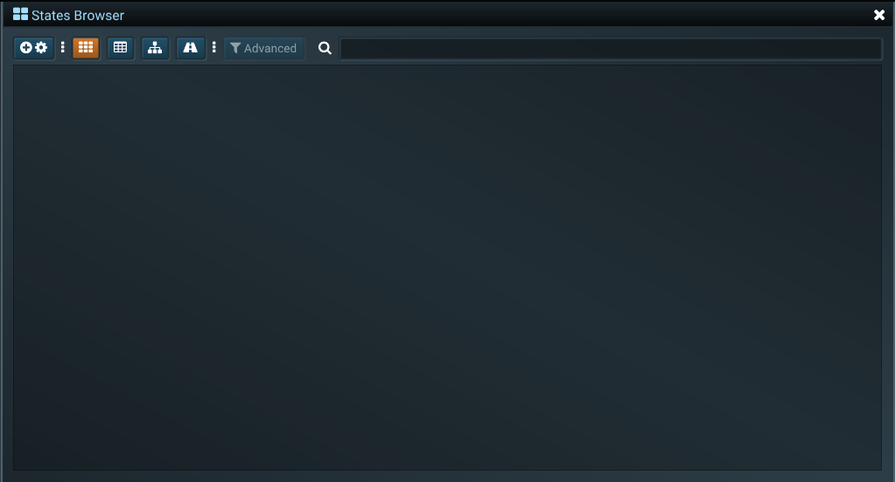
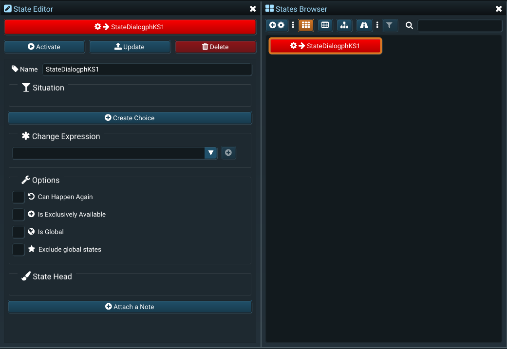

# Nonlinear System Tools
## Overview
Interactive stories require the one who interacts to make a choice. Choices make the story take a turn for the better or for the worse. NST is a full suite of tools for creating, analyzing and rendering branching or nonlinear stories, novels, poems, generic text  or even other media such as music or films.

NST consists of an Editor and a Reader, which are separate standalone programs. The NST Editor helps authors in creating nonlinear or branching stories, which then can be read inside the NST Reader. 

*The NST Editor in action*

## Concepts
### &#xf085; Systems
A &#xf085; **system** or a **story** is a **project** created inside NST. Creating a new story in NST means creating a new project. Each system has only 2 components: &#xf013; **states** and &#xf02d; **properties**. Systems are completely deterministic.
### &#xf013; States
A &#xf013; **state** is a single moment in time in a story. One story has only one active state at every moment, which describes what's the situation at that point in time. The state can be activated by a player choice, may it be active or passive. Each story has a single &#xf061; **entry state** which describes the starting point of the story. The state may be available based on the state's &#xf0cb; **availability expression**. The  &#xf0cb; availability expression describes what needs to have happened in the story for the state to become a choice for the one who interacts. For example, one can drive a car if he had previously at some point bought a car. This is a relationship specified in the state's &#xf0cb; availability expression. When a state becomes active (a player makes a choice) it can change a property value using the &#xf069; **change expressions**.  
### &#xf02d; Properties
A &#xf02d; **property** is a named numeric value which can be used inside expressions. For example, a property may hold a character's health, wether a character has an item or not, an item's damage value, the relationship status between two characters, and so on. States may use property values inside &#xf0cb; **availabilty expressions** to determine wether they are available (for example, a state in which a character dies if his health is equal to 0), or inside the &#xf069; **change expressions** (for example, a character swings his sword and inflicts 20 damage to another character's health). 
### &#xf06c; Branches
A &#xf06c; **branch** is a special type of component in a system which tracks what has already happened (the order of activation of states). This allows authors to rewind the time or advance it forwards. Branches can also be saved and reloaded later.
# NST Editor
## Quick Start Guide
In this guide we will create a simple branching story to demonstrate capabilities of the NST Editor. This story is also available on the &#xf1b7; Steam Workshop and is also showcased in some of the trailer videos.
### Creating Stories
When starting NST Editor for the first time, a new story is automatically created. You can also create a new story by going to **&#xf15b; File > &#xf067; New**. To give a name to the story you have to save it first. To save a story with a new name go to the menu **Story[Name] > &#xf0c7; Save As > [Enter a Name] > &#xf00c; Confirm**. This will save the story inside the **[Root Folder]/stories** folder. 
>[!TIP]
To load a story go to the menu **&#xf15b; File > &#xf07c; Load**, which lists all the availabile stories inside the **[Root Folder]/stories** folder. You can quickly open the stories folder by clicking on **&#xf15b; File > &#xf07c; Stories Folder**. 
### Using States
To create a new state inside the story you must use the &#xf009; States Browser window, which is located under **&#xf2d0; Window > &#xf009; States Browser**. The &#xf009; States Browser in an empty story is shown on the image below. You can move and dock this window by clicking and dragging the title.

Clicking on the **&#xf055;&#xf013;** button on the far left will create a new state. Each state in the &#xf009; States Browser window is represented by a clickable button. To edit a state you have to right-click it and select &#xf044; **Edit** which will automatically open the &#xf044; **State Editor** window. The image below shows the &#xf044; State Editor and the &#xf009; States Browser side by side.

### Using Properties
## Reference
### States Browser
### State Editor
### Property Editor
### Read in Editor
### Content Browser
### Time Controller
### Note Editor
### Steam Workshop
### Log
### Profiler
### Command History
### Syncing Reader
### Settings
## Files
### NTX
### NTS
### XML
# NST Reader
## Loading Stories
## Reading Stories
# Changelog
> [!NOTE]
Last Updated: 5 October 2021