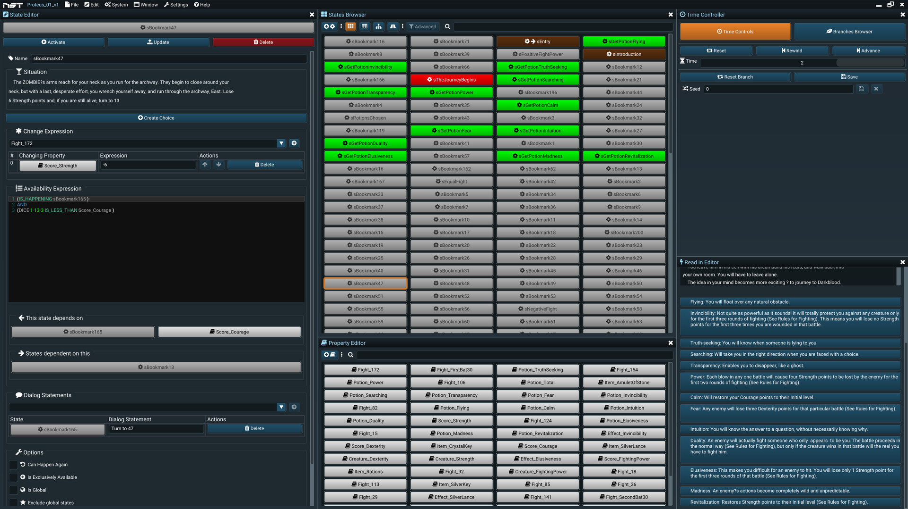

# Version
**Version:** 0.2.211203

**Last Updated:** 12 October 2021

**Caretaker:** Martin Petkovski
# Overview
Interactive stories require the one who reads to make a choice. Choices make the story take a turn for the better or for the worse. NST is a full suite of tools for creating, analyzing and rendering branching or nonlinear stories, novels, poems, generic text or even other media such as music or films.

NST aims to provide authors with tools which keep a linear level of complexity, regardless of the number of branching paths the story might contain. When using **[Twine](https://twinery.org/)**, **[Ink](https://www.inklestudios.com/ink/)** or other similar tools, the branching gets more difficult with every new branch an author creates, just because of the nature of dragging lines on a graph or referencing labels in a script. NST manages to overcome this particular issue by using innovative ways of connecting specific moments of time inside the story by taking away explicit connections and relying on discrete conditions under which something can happen.

NST consists of an Editor and a Reader, which are separate standalone programs. The NST Editor helps authors in creating nonlinear or branching stories, which then can be read inside the NST Reader. 

# Concepts
## &#xf085; Systems
A &#xf085; **system** or a **story** is a **project** created inside NST. Creating a new story in NST means creating a new project. Each system has only 2 components: **&#xf013; states** and &#xf02d; **properties**. Systems are completely deterministic.
## &#xf013; States
A **&#xf013; state** is a single moment in time in a story. One story has only one active state at every moment, which describes what's the situation at that point in time. The state can be activated by a player choice, may it be active or passive. Each story has a single **&#xf061; entry state** which describes the starting point of the story. The state may be available based on the state's **&#xf0cb; availability expression**. The &#xf0cb; availability expression describes what needs to have happened in the story for the state to become a choice for the one who interacts. For example, one can drive a car if he had previously at some point bought a car. This is a relationship specified in the state's &#xf0cb; availability expression. When a state becomes active (a player makes a choice) it can change a property value using the **&#xf069; change expressions**.  
## &#xf02d; Properties
A **&#xf02d; property** is a named numeric value which can be used inside expressions. For example, a property may hold a character's health, whether a character has an item or not, an item's damage value, the relationship status between two characters, and so on. &#xf013; States may use &#xf02d; property values inside **&#xf0cb; availabilty expressions** to determine whether they are available (for example, a &#xf013; state in which a character dies if his health is equal to 0), or inside the **&#xf069; change expressions** (for example, a character swings his sword and inflicts 20 damage to another character's health). 
## &#xf06c; Branches
A **&#xf06c; branch** is a special type of component in a system which tracks what has already happened (the order of activation of states). This allows authors to rewind the time or advance it forwards. Branches can also be saved and reloaded later.