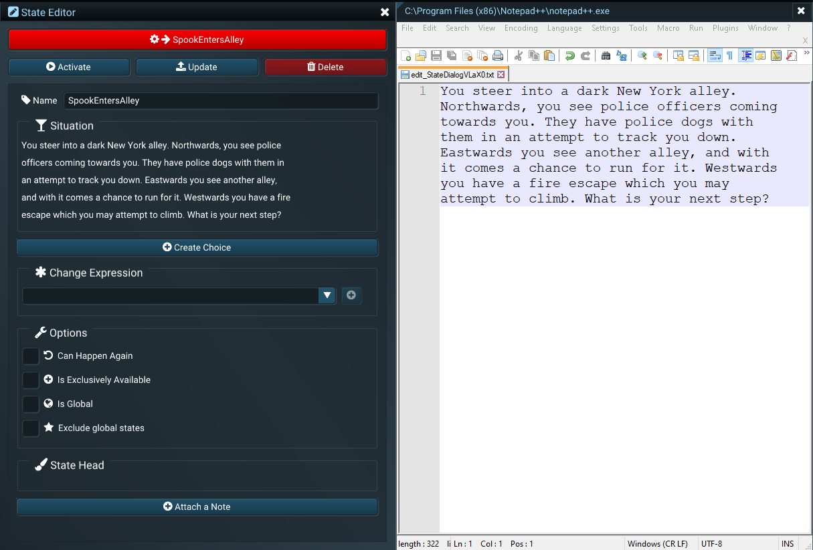
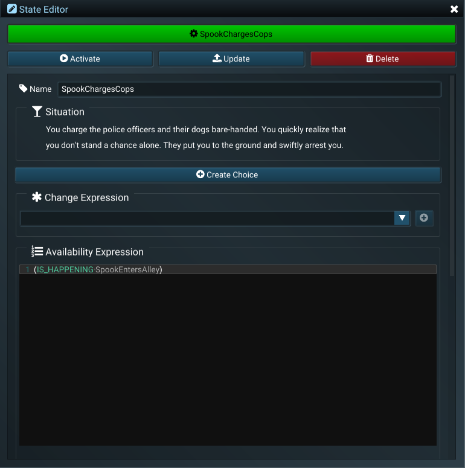
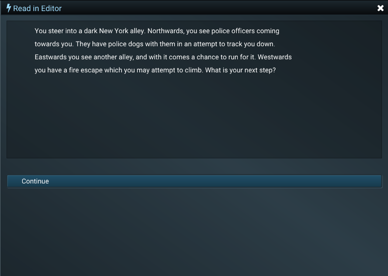
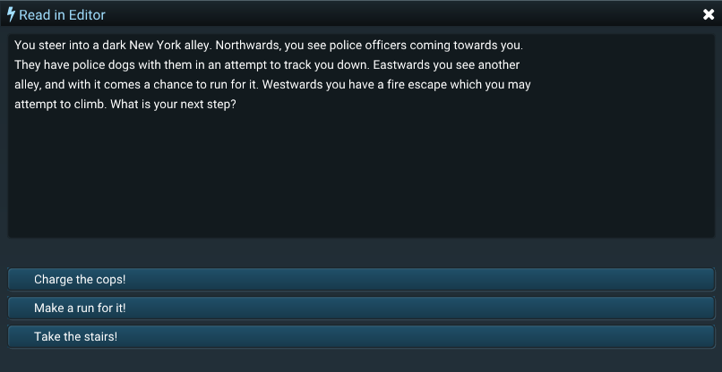
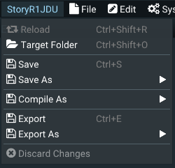
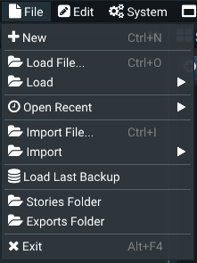
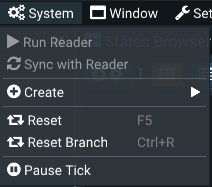
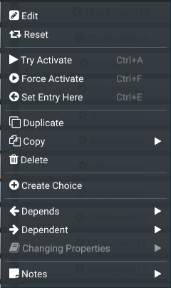
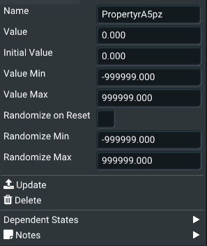
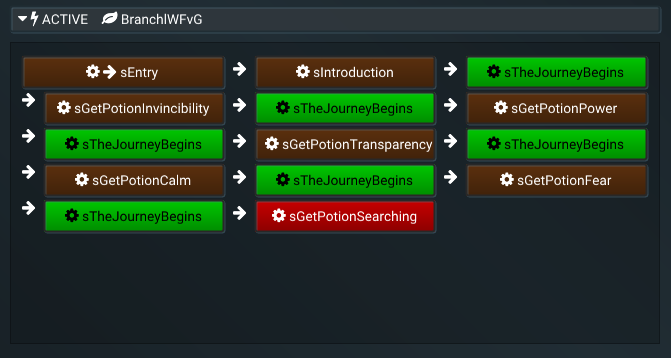

# Nonlinear System Tools
## Version
**Version:** 0.2.211203

**Last Updated:** 8 October 2021

**Caretaker:** Martin Petkovski
## Overview
Interactive stories require the one who reads to make a choice. Choices make the story take a turn for the better or for the worse. NST is a full suite of tools for creating, analyzing and rendering branching or nonlinear stories, novels, poems, generic text or even other media such as music or films.

NST aims to provide authors with tools which keep a linear level of complexity, regardless of the number of branching paths the story might contain. When using **[Twine](https://twinery.org/)**, **[Ink](https://www.inklestudios.com/ink/)** or other similar tools, the branching gets more difficult with every new branch an author creates, just because of the nature of dragging lines on a graph or referencing labels in a script. NST manages to overcome this particular issue by using innovative ways of connecting specific moments of time inside the story by taking away explicit connections and relying on discrete conditions under which something can happen.

NST consists of an Editor and a Reader, which are separate standalone programs. The NST Editor helps authors in creating nonlinear or branching stories, which then can be read inside the NST Reader. 

## Concepts
### &#xf085; Systems
A &#xf085; **system** or a **story** is a **project** created inside NST. Creating a new story in NST means creating a new project. Each system has only 2 components: **&#xf013; states** and &#xf02d; **properties**. Systems are completely deterministic.
### &#xf013; States
A **&#xf013; state** is a single moment in time in a story. One story has only one active state at every moment, which describes what's the situation at that point in time. The state can be activated by a player choice, may it be active or passive. Each story has a single **&#xf061; entry state** which describes the starting point of the story. The state may be available based on the state's **&#xf0cb; availability expression**. The &#xf0cb; availability expression describes what needs to have happened in the story for the state to become a choice for the one who interacts. For example, one can drive a car if he had previously at some point bought a car. This is a relationship specified in the state's &#xf0cb; availability expression. When a state becomes active (a player makes a choice) it can change a property value using the **&#xf069; change expressions**.  
### &#xf02d; Properties
A **&#xf02d; property** is a named numeric value which can be used inside expressions. For example, a property may hold a character's health, whether a character has an item or not, an item's damage value, the relationship status between two characters, and so on. &#xf013; States may use &#xf02d; property values inside **&#xf0cb; availabilty expressions** to determine whether they are available (for example, a &#xf013; state in which a character dies if his health is equal to 0), or inside the **&#xf069; change expressions** (for example, a character swings his sword and inflicts 20 damage to another character's health). 
### &#xf06c; Branches
A **&#xf06c; branch** is a special type of component in a system which tracks what has already happened (the order of activation of states). This allows authors to rewind the time or advance it forwards. Branches can also be saved and reloaded later.
# NST Editor

The NST Editor is the place where stories are edited and debugged. In the current version, it requires a working internet connection and an active &#xf1b7; Steam connection. Anonymous data is sent back to us only when the editor crashes, containing information related to the crash.

## Quick Start Guide
In this guide we will create a simple branching story to demonstrate capabilities of the NST Editor. This story is called Spook's Adventures, and is also available on the &#xf1b7; Steam Workshop and is also showcased in some of the trailer videos. The main character (Spook) finds himself in a New York alley, chased by cops. He will have 3 choices. His choices will be: to charge the cops, to run for it eastwards, or to take the stairs inside an apartment. 2 of the choices will lead to him being arrested in 2 different ways, and the third one will give Spook 2 additional choices. We will implement this mini story using the NST Editor.
### Creating Stories
When starting NST Editor for the first time, a new story is automatically created. You can also create a new story by going to **&#xf15b; File > &#xf067; New**. To give a name to the story you have to save it first. To save a story with a new name go to the menu **Story[Name] > &#xf0c7; Save As > [Enter a Name] > &#xf00c; Confirm**. This will save the story inside the **[Root Folder]/stories** folder. 
>[!TIP]
To load a story go to the menu **&#xf15b; File > &#xf07c; Load**, which lists all the availabile stories inside the **[Root Folder]/stories** folder. You can quickly open the stories folder by clicking on **&#xf15b; File > &#xf07c; Stories Folder**. 
### Using States
To create a new &#xf013; state in the story you can use the **&#xf009; States Browser** window, which is located under **&#xf2d0; Window > &#xf009; States Browser**. The &#xf009; States Browser in an empty story is shown on the image below. You can move and dock this window by clicking and dragging the title.

Clicking on the **&#xf055;&#xf013;** button on the far left will create a new state. 

>[!TIP]
Another way of creating states is by going to the menu **&#xf085; System > &#xf055; Create > &#xf013; State**.

Each &#xf013; state in the &#xf009; States Browser window is represented by a clickable button. To edit a &#xf013; state you have to right-click it and select **&#xf044; Edit** which will automatically open the **&#xf044; State Editor** window. The image below shows the &#xf044; State Editor and the &#xf009; States Browser side by side.

You can edit all internal state properties in the &#xf044; State Editor. All edits are propagated inside the system by hitting the **&#xf093; Update** button.
>[!WARNING]
Selecting another state will **not** automatically update the changes on the current state. You must hit the **&#xf093; Update** button to propagate the changes. This will not be required in future versions of NST.

&#xf02b; Rename the newly created state to *SpookEntersAlley* and **&#xf093; Update** the state.

>[!NOTE]
Updating the same state with a different name will effectively trigger a rename. A state rename will warn the user if a name exists or if the name contains an illegal word or character.

>[!TIP]
You can view warnings and errors inside the **&#xf1c9; Log** window located under **&#xf2d0; Window > Editor Utilities > &#xf1c9; Log**. The last logged message is shown in the top right corner of the title bar for a couple of seconds after it happens.

The state **&#xf000; Situation** describes what is happening in the current moment in time. You can right-click on the **&#xf000; Situation** and choose **&#xf044; Edit With > &#xf15b; Notepad**. A new **&#xf15b; Notepad** window will open inside the NST Editor. You can move and dock the Notepad window just as you move and dock all other windows. To propagate the text you have written inside **&#xf15b; Notepad** to the NST Editor, just hit **&#xf0c7; Save** (or ctrl+s). 

In the **&#xf000; Situation** field for the *SpookEntersAlley* state enter the following text:

>You steer into a dark New York alley. Northwards, you see police officers coming towards you. They have police dogs with them in an attempt to track you down. Eastwards you see another alley, and with it comes a chance to run for it. Westwards you have a fire escape which you may attempt to climb. What is your next step?

Save the **&#xf15b; Notepad** file and close the **&#xf15b; Notepad** window. The State Editor window should look like the image below. Hit the **&#xf093; Update** button once again.

To create a new simple choice after Spook has entered the Alley, click on the **&#xf055; Create Choice** button. Clicking this button will create a new state which will be automatically linked to the *SpookEntersAlley* state. The newly created state will be automatically selected.

&#xf02b; Rename the state to *SpookChargesCops* and hit **&#xf093; Update**. Right-click on the **&#xf000; Situation** for the *SpookChargesCops* state, hit **&#xf044; Edit With > &#xf15b; Notepad**, and enter the following in the **&#xf15b; Notepad** window:

>You charge the police officers and their dogs bare-handed. You quickly realize that you don't stand a chance alone. They put you to the ground and swiftly arrest you.

Save the file in **&#xf15b; Notepad** and close the window. As you may notice, this time the **&#xf044; State Editor** looks a bit different than *SpookEntersAlley*'s view:

There is a field for the **&#xf0cb; Availability Expression** which has the value:
	
	IS_HAPPENING SpookEntersAlley
	
This means that when the state *SpookEntersAlley* is the current moment in time (i.e., active state), the state *SpookChargesCops* will be an available choice for the reader. 

In this case, clicking the **&#xf055; Create Choice** button fills the **&#xf0cb; Availability Expression** automagically, but it is fully editable nontheless.

Click **&#xf093; Update** to propagate the state changes.

You can now see the changes in action inside the **&#xf0e7; Read in Editor** window. You can open this window by clicking on **&#xf2d0; Window > Read in Editor**. This window shows the story in the current moment in time. To restart the story you can hit the **&#xf11c; F5** button on the keyboard. The **&#xf0e7; Read in Editor** should look like the image below:

Now, the button that leads to *SpookChargesCops* states only "*Continue*". To change this you must specify the **&#xf075; Dialog Statement** for *SpookEntersAlley* from *SpookChargesCops*. Select the *SpookChargesCops* by clicking on the state inside the **&#xf009; States Browser**. Scroll down to **&#xf075; Dialog Statements** inside the **&#xf044; State Editor**. From the dropdown select *SpookEntersAlley* and hit the &#xf055; button. In the **&#xf075; Dialog Statement** field enter "*Charge the cops!*". Hit **&#xf093; Update** on the state. This will change the button label for the choice *SpookChargesCops* when the state *SpookEntersAlley* is the active state.

>[!TIP]
Selecting *_ALL* in the **&#xf075; Dialog Statement** dropdown will set the label for all buttons, regardless of the state they are connected to. Adding additional **&#xf075; Dialog Statements** for specific states will simply override the label for the specified states, but will leave the *_ALL* be valid for the rest.

Next, create a new state and rename it to *SpookRunsEastwards*. Set the **&#xf000; Situation** to:

>You make a run for it eastwards. The police dogs are faster than you. They catch you before you can make it over the fence on the other side. You are arrested and taken into custody.

Set the **&#xf0cb; Availability Expression** to:

	IS_HAPPENING SpookEntersAlley
	
Set the **&#xf075; Dialog Statement** for the state *SpookEntersAlley* to "*Run for it!*".

Click **&#xf093; Update** to propagate the state changes.

And finally, create the last state in the same manner. 

It should be named *SpookTakesTheStairs*. Set the **&#xf000; Situation** to:

>You climb the fire escape stairs and go inside an apartment through the window. It's a lavish apartment like you never would've expected in this part of town. It's dark, but there is a strange light coming from behind the bookshelves. What will you do?

Again, set the **&#xf0cb; Availability Expression** to:

	IS_HAPPENING SpookEntersAlley
	
Set the **&#xf075; Dialog Statement** for the state *SpookEntersAlley* to "*Take the stairs!*".

Hit **&#xf093; Update** to propagate the state changes.

After you complete the steps above, the view inside the **&#xf2d0; Window > Read in Editor** should look like the image below:

Clicking on any of the buttons inside the **&#xf0e7; Read in Editor** should lead you to the correct state specified on the button label.

>[!NOTE]
**&#xf188; BUG:** When creating new states you should hit F5 to propagate the changes, just in case. This is not the intended behavior and will be fixed in future versions.

## Reference

### Main Menu

The main menu is shown at the top of the NST Editor. If you are not logged in to &#xf1b7; Steam, a message will appear instead of the main menu items. If another thread is currently doing some work (i.e., loading a story), a progress bar will appear instead of the items. The items will be shown again as soon as the thread finishes it's work. 

The items on the main menu have various general-purpose functions which will be listed below.

---

#### NST
The name of the editor, animates when actions on the story file are performed.

---

#### [Story Name]

 Indicates the currently loaded story. This story may or may not be saved on disk. To view actions that can be performed on the story itself click on the story name.

**Reload** - If there is a file for the story present on disk, it will reload the story from that file.

**Target Folder** - Opens the folder where the story is located or would be located on disk.

**Save** - Saves the current story in the target folder in binary **.nts** format. The target folder is located in **[exe folder]/stories**.

**Save As** - Saves the current story in the target folder with a new name which the user can specify before clicking **Confirm**. The format is **.nts** binary.

**Compile As** - Compiles the current story in binary **.nts** format, effectively making the file contents read-only. Use with caution.

**Export** - Saves the current story in the exports folder in plain text **.xml** format. The target folder is located in **[exe folder]/exports**.

**Export As** - Saves the current story in the exports folder in plain text **.xml** format with a new name. The target folder is located in **[exe folder]/exports**.

**Discard Changes** - Undo-s everything up until the last save. This action can be redo-ed later.

---

#### File
This menu holds all file-related functions of the NST Editor.

**New** - Will create a new story with a randomly generated name.

**Load File...** - Will open a load file dialog in which you can select a **.nst** file to load. 

**Load** - Will list all **.nst** files available inside the **[exe folder]/stories** folder. Clicking on an item will load it. You can filter the items by using the text box located at the top of the list.

**Open Recent** - Lists all recently opened files, with the topmost being the most recent. Clicking on an item will load it.

**Import File...** - Will open an import file dialog in which you can select a **.xml** file to load.

**Import** - Will list all **.xml** files available inside the **[exe folder]/exports** folder. Clicking on an item will load it. You can filter the items by using the text box located at the top of the list.

**Load Last Backup** - Will load the last available backup. This might not match the current story, depending on when it was saved. The last saved time will show up when the item is hovered.

**Stories Folder** - Will open the **[exe folder]/stories** folder in Windows Explorer.

**Exports Folder** - Will open the **[exe folder]/exports** folder in Windows Explorer.

**Exit** - Will gracefully close the editor.

---

#### Edit
This menu holds the undo / redo commands.

**Undo** - Undo-s the last command.

**Redo** - Executes the next command again.

---

#### System 
This menu holds all commands related to the system.

**Run Reader** - If the NST Reader exists in the same working directory, it can be started by clicking on this item.

**Sync with Reader** - Enabled if applicable. Can be true or false. If it's true than the previously started instance of the NST Reader will sync to the actions inside the NST Editor.

**Create** - Lists the system components. You can create both states and properties from this menu.

**Reset** - Resets the complete system and assigns a new seed value. This means that random events will have new values.

**Reset Branch** - Resets only the branch you are currently on, keeping the seed value. Random events will happen in the same way each time you reset the branch.

**Pause Tick** - Will pause the system updates. This will not stop the editor execution, but will stop the evaluation of all internal state and system properties.

---

#### Window
Holds list of all available windows in the NST Editor. This does not include external editors or the NST Reader. This list includes:

Editor Utilities: Log, Profiler, Command History

State Editor

Property Editor

States Browser

Read in Editor

Content Browser

Time Controller

Note Editor

Steam Workshop

---

#### Settings
Lists all the available editor options. A click selects only one option.

Available languages: English (Default) and Macedonian

Available themes: Aegean Nights (desturated blue), Pacific Dawn (dark purple), Talk Yawl (stronger blue)

Backup frequencies: No backups, Rare (backup every 30 actions), Frequent (backup every 5 actions), Always (backup on every action).

---

#### Notification area
Displays short message for a few seconds. This message is also available in the Log window.

---

### Text Input
All text components inside NST Editor can be edited with the right-click context menu. NST Editor doesn't ship with an integrated text editor, but allows the author to choose a preffered external text editor. Currently there are 4 available editors: Notepad (ships with Windows), [Notepad++](https://notepad-plus-plus.org/), [Sublime Text 4](https://www.sublimetext.com/) and [Microsoft Word](https://www.office.com/). The text editor will be launched inside the NST Editor and behaves as any other NST Editor window does. It can be moved, docked, undocked and closed. Saving the file inside the preffered text editor will automagically propagate the changes made to the text inside the NST Editor. The standard items found in the right-click context menu include:

**&#xf044; Edit With > [Preffered Editor]** - Edits the text contents. After selecting a text editor, a new window of your preffered editor will pop-up. You may drag and dock this window as you do with other windows. After you are satisfied with your changes you need to hit save in your preffered editor and with that the changes you made will be automagically propagated inside the NST Editor. At this point you may close the text editor window.

**&#xf0c5; Copy** - Copy the text contents to clipboard.

**&#xf0c4; Cut** - Cut the text contents to clipboard.

**&#xf0ea; Paste** - Paste from clipboard to text contents. This action will overwrite the existing content.

**&#xf057; Clear** - Clear the text contents.

### &#xf013; State Button
Each [**&#xf013; state**](#xf013-states) in the NST Editor is represented by a single button labeled with the state's **&#xf02b; name**. States as buttons appear throughout the NST Editor. Clicking on the button will select the state and open it for edit inside the **&#xf044; State Editor**. Holding ctrl and clicking on state buttons will select multiple states. Selected states have a golden border around the button.

The active state's button is red, if the state is available the button is green and if the state has been activated the button is dark red. The entry state has the &#xf061; icon in front of the name.

Right-clicking a state's button will open up a context menu containing additional actions. 

**&#xf044; Edit** - Will select the state and open the **&#xf044; State Editor**.

**&#xf079; Reset** - Will reset all passive properties of a state. It will clear the *activated* flag as if this state never happened.

**&#xf04b; Try Activate** - The state will be activated only if it's available.

**&#xf144; Force Activate** - The state will be forcefully activated.

**&#xf0a8; Set Entry State** - The state will become the entry state to the story. The entry state becomes the active state when the story is started / restarted.

**&#xf24d; Duplicate** - Creates a perfect copy of the state with a new name.

**&#xf0c5; Copy** - Copies the specified state property to clipboard.

**&#xf1f8; Delete** - Deletes the state. The entry state cannot be deleted - specify a new entry state before deleting it.

**&#xf055; Create Choice** - Creates a new state, selects it and links the contexted state to it with `IS_HAPPENING [ContextedStateName]`.
 
**&#xf060; Depends** - If applicable, lists all the states on which this state depends (i.e. what needs to happen for this state to become available). 

**&#xf061; Dependent** - If applicable, lists all the states that depend on this state (i.e. the contexted state needs to happen for these states to become available).

**&#xf061; Changing Properties** - If applicable, lists all the properties that are changed by this state.

**&#xf249; Notes** - Lists all the notes attached to the state. Clicking on **&#xf055; Attach a Note** will create a new note and attach it to this state.

If multiple states are selected the context menu offers limited options which include: **&#xf079; Reset**, **&#xf24d; Duplicate** and **&#xf1f8; Delete**.

### &#xf02d; Property Button
Each **&#xf02d; property** in the NST Editor is represented by a single button labeled with the property's name. Properties as buttons appear throughout the NST Editor, sometimes besides states. You can distinguish between them by the icon that appears in front of the name. Clicking the button will highlight all states that depend on this property's value, regardless of which window they appear in.

Right-clicking a property's button will open up a context menu containing additional actions.

 
 **Name** - The name of the property. It must be unique, not contain special characters or blank spaces. Updating the same property with a different name will effectively trigger a rename. A property rename will warn the user if a name exists or if the name contains an illegal word or character.
 
 **Value** - The current value of the property.
 
 **Initial Value** - The initial value of the property. The property value will be set to this value when the story is started or restarted.
 
 **Value Min** - If the current value is less than this value it will be set to this value.
 
 **Value Max** - If the current value exceeds this value it will be set to this value.
 
 **Randomize on Reset** - Each time the story restarts, the current value will get a random value in a specified range. The value will depend on the story or branch seed.
 
 **Randomize Min** - The lower bound for the random number.
 
 **Randomize Max** - The upper bound for the random number.
 
 **&#xf093; Update** - Updates the property with the new values.
 
 **&#xf1f8; Delete** - Deletes the property.
 
 **Dependent States** - Lists all dependent states. These states will be highlighted by clicking on the property button. 
 
 **&#xf249; Notes** - Lists all the notes attached to the property. Clicking on **&#xf055; Attach a Note** will create a new note and attach it to this property.

### &#xf06c; Branch Expander
Each **&#xf06c; branch** is represented by an expander inside the **&#xf017; Time Controller** window. A branch can be active (loaded) inside the story to which it belongs. The branch that is active can be time-manipulated by the user. Each branch may be saved and loaded (activated).

The expander displays the name of the branch. It will show **&#xf0e7; Active** in front of the name of the branch that is currently active. The expander can be expanded and collapsed. The content when it is expanded are the sequence of states representing the branch. There may be duplicate states in the sequence if the state has been activated multiple times.

Right-clicking on the expander title will open a context menu. 

**&#xf253; Load** - Will load the branch (make it active). Loading the branch will activate a state which was saved as active along with the branch. It will also set all internal properties of all states as they were at the time when the branch was saved. After the branch is loaded a user may **&#xf017; control the time** on it by rewinding or advancing the state activation.

**&#xf246; Rename** - Renames the branch.

**&#xf1f8; Delete** - Deletes the branch.

### &#xf249; Note Display

Notes may be displayed on various places inside the NST Editor. They have a frame with a **&#xf249; Note** caption. Notes are a [standard text input component](#text-input) and can be edited by right-clicking on the content. There are additional items in the context menu specific to notes:

**&#xf08d; Pin** - Pins the note to the top.

**&#xf12a; Important** - Colors the note red.

**&#xf0c1; Detach** - Detaches the note from the item. This does not delete the note, it will still be available through the **&#xf249; Note Editor**.

**&#xf1f8; Delete** - Detaches the note from all items and deletes it.

### &#xf14b; State Editor

>[!NOTE] Multiple states cannot be edited inside the state editor. If multiple states are selected the editor will show a message to indicate so.

#### Action Buttons
The topmost element is the [State Button](#xf013-state-button) for the currently selected state.

**&#xf144; Activate** - The state will be forcefully activated.

**&#xf093; Update** - All changes to the state inside the editor will be propagated inside the system.

>[!WARNING]
Hit the **&#xf093; Update** button as often as possible when making changes. If another state is selected without first updating the current state all changes will be lost. This behavior is still under development and will change in future releases.

**&#xf1f8; Delete** - Deletes the state.

#### &#xf02b; State Name
All states are uniquely identified by their name. A state's name must be unique and must not contain any special characters, reserved words or empty spaces. These rules exist because names are used inside expressions to identify the states. Right-clicking on the name editing text box will bring up additional text options.

#### Situation
The situation is the description of what's going on at some point in time. It will show up in the reading area when the state is active. The situation is a [standard text input component](#text-input) that can be edited with an external text editor. Right-clicking on it will bring up more options.

>[!TIP]
The situation content may contain any HTML5 / JS / CSS code you may choose to enter. This code will be rendered inside the NST Reader, but not inside the Read in Editor window.

#### Create Choice button

Clicking this button will create a new state which will be automatically linked to this state. The link is created by automagically adding `IS_HAPPENING [ThisStateName]` in the new state's availability expression. The newly created state will then be automatically selected.

#### Change Expression

>[!WARNING] This component is still under development and may or may not change in future releases.

#### Availability Expression

>[!WARNING] This component is still under development and may or may not change in future releases.

#### This state depends on

Lists all the states and properties that this state depends on. The dependency might or might not be exclusive.

#### States dependent on this

Lists all states that depend on this state. The dependency might or might not be exclusive.

#### Dialog statements

#### Options

#### State Head

#### Notes

### &#xf009; States Browser
### &#xf02d; Property Editor
### &#xf0e7; Read in Editor
### &#xf1b2; Content Browser
### &#xf017; Time Controller
### &#xf249; Note Editor
### &#xf1b7; Steam Workshop
### &#xf1c9; Log
### &#xf0ae; Profiler
### &#xf1da; Command History
### Syncing Reader
### Settings
## Files
### NTX
### NTS
### XML
# NST Reader
## Loading Stories
## Reading Stories
# Changelog