# Version
**Version:** 0.3.220409

**Last Updated:** 09 April 2022

**Caretakers:** Martin Petkovski

# Contact

**Email:** (martin@najjak.com)

**Discord:** https://discord.com/invite/sxeD79nuBP 

# Overview
Interactive stories allow readers to make choices which in turn determine the outcome of the story. NST allows authors to produce such content by bringing a full suite of tools to help you create, analyze and render both branching and nonlinear content, including stories, novels, poems, generic text, as well as music or films.

When using **[Twine](https://twinery.org/)**, **[Ink](https://www.inklestudios.com/ink/)** or similar tools, the complexity of the branching process rises with every new branch created by the author, due to the nature of graphs and scripts, which make it a necessity for the author to drag lines on a graph or reference labels in a script. NST manages to overcome this particular issue by using innovative ways of connecting specific moments of time inside the story by taking away explicit connections and relying upon discrete conditions under which something can happen.

Ultimately, NST aims to provide authors with tools that obtain a linear complexity, regardless of the number of branching paths a story might contain

NST comes with an Editor and a Reader as two separate, standalone programs. The NST Editor helps authors in creating nonlinear or branching stories, which can afterwards be read inside the NST Reader.

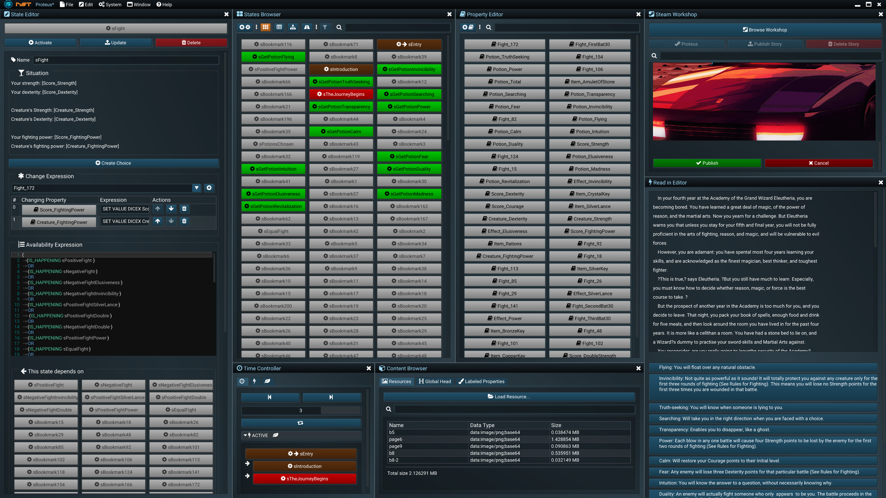

# Concepts
## &#xf085; Systems
A &#xf085; **system** or a **story** is a **project** created inside NST. Creating a new story in NST means creating a new project. Each system has only 2 components: **&#xf013; states** and &#xf02d; **properties**. Systems are completely deterministic.
## &#xf013; States
A **&#xf013; state** is a single moment in time within a story. Each story has a single active state at any moment, which describes what the situation is at the exact moment in time. The state can be activated by a player choice, which can be active or passive.

Each story has a single **&#xf061; entry state** which describes the starting point of the story. The availability of the state depends on its [**&#xf0cb; Availability Expression**](#xf0cb-availability-expression), that describes circumstances in which the state can become an available choice for the subject interacting with the story.

For instance, for one to be able to drive a car, one needs to buy the car first. The [**&#xf0cb; Availability Expression**](#xf0cb-availability-expression) specifies these types of relationships. Once a state becomes active (cause by a player choice), it can cause a change in the property value using the [**&#xf069; change expressions**](#xf069-change-expression).
 
## &#xf02d; Properties

A **&#xf02d; property** is a named numeric value that can be used within expressions. To illustrate, a **&#xf02d; property** may be a certain character's health, whether a character has an item or not, an item's damage value, the relationship status between two characters, etc.

**&#xf013; States** may use **&#xf02d; property** values inside the [**&#xf0cb; Availability Expression**](#xf0cb-availability-expression) to determine whether or not they are available (ex. a **&#xf013; state** in which a character dies if his health is equal to 0) or within the [**&#xf069; change expressions**](#xf069-change-expression) (ex. a character swings his sword and inflicts 20 damage to another character's health).

## &#xf06c; Branches

A **&#xf06c; branch** is a special type of component in a system which keeps track of what has already happened (the order of activation of states). This allows authors to rewind the time or advance it forwards. Branches can also be saved and reloaded later.

# NST Editor

The NST Editor is the place where stories are edited and debugged. The current version requires a working internet connection as well as an active **&#xf1b7; Steam** connection.

# Quick Start Guide

In this guide, we will create a simple branching story to demonstrate the capabilities of the NST Editor. The story is called Spook's Adventures, it is available on the **&#xf1b7; Steam Workshop** and it is also showcased in some of the trailer videos.

The main character (Spook) finds himself chased by cops in a New York alley. He will have 3 choices: to charge the cops, to run for it eastwards, or to take the stairs inside an apartment. 2 of the choices will lead to him getting arrested in 2 different ways, whereas the third one will give Spook 2 additional choices. Let’s implement this mini-story into the NST Editor.

## Creating Stories
As soon as you start the NST Editor for the first time, a new story is automatically created. You can also create a new story by going to **&#xf15b; File > &#xf067; New**. To name the story you have to save it first. To save a story under a new name, go to the menu **Story[Name] > &#xf0c7; Save As > [Enter a Name] > &#xf00c; Confirm**. This will save the story in the **[Root Folder]/stories** folder. 

>[!TIP]
To load a story go to the menu **&#xf15b; File > &#xf07c; Load**, which lists all the available stories inside the **[Root Folder]/stories** folder. You can quickly open the stories folder by clicking on **&#xf15b; File > &#xf07c; Stories Folder**. 

## Using States

To create a new [**&#xf013; state**](#xf013-states) in the story, you can use the [**&#xf009; States Browser**](#xf009-states-browser) window, which is located under **&#xf2d0; Window > &#xf009; States Browser**. The [**&#xf009; States Browser**](#xf009-states-browser) in an empty story is displayed in the image below. You can move and dock this window by clicking and dragging the title.

Clicking on the far left **&#xf055;&#xf013;** button will create a new state. 

>[!TIP]
Another way of creating states is by going to the menu **&#xf085; System > &#xf055; Create > &#xf013; State**.

Each [**&#xf013; state**](#xf013-states) in the [**&#xf009; States Browser**](#xf009-states-browser)  window is represented by a [clickable button](#xf013-state-button). To edit a [**&#xf013; state**](#xf013-states) you need to right-click it and select **&#xf044; Edit** which will automatically open the [**&#xf044; State Editor**](#xf14b-state-editor) window. The image below shows the [**&#xf044; State Editor**](#xf14b-state-editor) and the [**&#xf009; States Browser**](#xf009-states-browser) side by side.

You can edit all internal state properties in the [**&#xf044; State Editor**](#xf14b-state-editor). All edits are propagated inside the system once you click on the **&#xf093; Update** button.

>[!WARNING]
Selecting another state will **not** automatically update the changes to the current state. You need to hit the **&#xf093; Update** button to propagate the changes. This will not be required in future versions of NST.

**&#xf02b; Rename** the newly created state to *SpookEntersAlley* and **&#xf093; Update** the state.

>[!NOTE]
Updating the same state under a different name will effectively trigger a rename. A state rename will warn the user should a new name exist or if the name contains an illegal word or character.

>[!TIP]
You can view warnings and errors inside the [**&#xf1c9; Log**](#xf1c9-log) window located under **&#xf2d0; Window > Editor Utilities > &#xf1c9; Log**. The last logged message will be displayed at the top right corner of the title bar for a couple of seconds after it occurs.

The state [**&#xf000; Situation**](#xf000-situation) describes what is happening in the current moment in time. You can right-click on the [**&#xf000; Situation**](#xf000-situation) and [choose **&#xf044; Edit With > &#xf15b; Notepad**](#text-input). A new **&#xf15b; Notepad** window will open within the NST Editor. You can move and dock the Notepad window just as you move and dock all other windows. To propagate the text written in **&#xf15b; Notepad** to the NST Editor, click **&#xf0c7; Save** (or Ctrl+S). 

Enter the following text in the [**&#xf000; Situation**](#xf000-situation) field for the *SpookEntersAlley* state:

>You steer into a dark New York alley. Northwards, you see police officers coming towards you. They have police dogs with them in an attempt to track you down. Eastwards you see another alley, and with it comes a chance to run for it. Westwards you have a fire escape which you may attempt to climb. What is your next step?

Save the **&#xf15b; Notepad** file and close the **&#xf15b; Notepad** window. The State Editor window should look like as displayed in the image below. Hit the **&#xf093; Update** button once again.

To create a new simple choice after Spook has entered the Alley, click on the **&#xf055; Create Choice** button. Clicking this button will create a new state which will automatically be linked to the *SpookEntersAlley* state. The newly created state will be automatically selected.

**&#xf02b; Rename** the state to *SpookChargesCops* and click **&#xf093; Update**. Right-click on the **&#xf000; Situation** for the *SpookChargesCops* state, [hit **&#xf044; Edit With > &#xf15b; Notepad**](#text-input), and enter the following text in the **&#xf15b; Notepad** window:

>You charge the police officers and their dogs bare-handed. You quickly realize that you don't stand a chance alone. They put you to the ground and swiftly arrest you.

Save the file in **&#xf15b; Notepad** and close the window. As you may have noticed, this time the [**&#xf044; State Editor**](#xf14b-state-editor) looks a bit different than *SpookEntersAlley*'s view:

There is a designated field for the [**&#xf0cb; Availability Expression**](#xf0cb-availability-expression) containing the value:
	
	IS_HAPPENING SpookEntersAlley
	
This means that whenever the state *SpookEntersAlley* is the current moment in time (i.e., active state), the state *SpookChargesCops* will be an available choice for the reader. 

In this case, clicking the **&#xf055; Create Choice** button fills the [**&#xf0cb; Availability Expression**](#xf0cb-availability-expression) automatically, but it is fully editable nonetheless.

Click **&#xf093; Update** to propagate the state changes.

You can now see the changes in action inside the [**&#xf0e7; Read in Editor**](#xf0e7-read-in-editor) window. You can open this window by clicking on **&#xf2d0; Window > &#xf0e7; Read in Editor**. This window shows the story in the current moment in time. To restart the story, you can click the [**&#xf11c; F5** button](#keyboard-shortcuts) on the keyboard. The [**&#xf0e7; Read in Editor**](#xf0e7-read-in-editor) should look as displayed below:

Now, the button that leads to *SpookChargesCops* states only "*Continue*". To change this you need to specify the [**&#xf075; Dialog Statement**](#dialog-statements) for *SpookEntersAlley* from *SpookChargesCops*. Select the *SpookChargesCops* by clicking on the state inside the [**&#xf009; States Browser**](#xf009-states-browser). Scroll down to [**&#xf075; Dialog Statements**](#dialog-statements) inside the [**&#xf044; State Editor**](#xf14b-state-editor). Select *SpookEntersAlley* from the dropdown and click on the &#xf055; button. Enter "*Charge the cops!*" in the [**&#xf075; Dialog Statement**](#dialog-statements) field and **&#xf093; Update** the state. This will change the button label for the choice *SpookChargesCops* when the state *SpookEntersAlley* becomes the active state.

>[!TIP]
Selecting *__ALL* in the [**&#xf075; Dialog Statement**](#dialog-statements) dropdown will set the label for all buttons, regardless of the state they are connected to. Adding additional [**&#xf075; Dialog Statements**](#dialog-statements) for specific states will simply override the label for the specified states, leaving *__ALL* intact.

Next, create a new state and rename it to *SpookRunsEastwards*. Set the [**&#xf000; Situation**](#xf000-situation) to:

>You make a run for it eastwards. The police dogs are faster than you. They catch you before you can make it over the fence on the other side. You are arrested and taken into custody.

Set the [**&#xf0cb; Availability Expression**](#xf0cb-availability-expression) to:

	IS_HAPPENING SpookEntersAlley
	
Set the [**&#xf075; Dialog Statement**](#dialog-statements) for the state *SpookEntersAlley* to "*Run for it!*".

Click **&#xf093; Update** to propagate the state changes.

Finally, create the last state in the same manner. 

It should be named as *SpookTakesTheStairs*. Set the [**&#xf000; Situation**](#xf000-situation) to:

>You climb the fire escape stairs and go inside an apartment through the window. It's a lavish apartment like you never would've expected in this part of town. It's dark, but there is a strange light coming from behind the bookshelves. What will you do?

Again, set the [**&#xf0cb; Availability Expression**](#xf0cb-availability-expression) to:

	IS_HAPPENING SpookEntersAlley
	
Set the [**&#xf075; Dialog Statement**](#dialog-statements) for the state *SpookEntersAlley* to "*Take the stairs!*".

Click **&#xf093; Update** to propagate the state changes.

Once you complete the steps above, the view inside the [**&#xf0e7; Read in Editor**](#xf0e7-read-in-editor) should appear as displayed below:

Clicking on any of the buttons inside the [**&#xf0e7; Read in Editor**](#xf0e7-read-in-editor) should lead you to the correct state specified on the button label.

>[!NOTE]
**&#xf188; BUG:** When creating new states, you should hit F5 to propagate the changes, just in case. This is not the intended behavior and will be fixed in future versions.

>[!NOTE] Anonymous data is sent back to us only when the Editor crashes, containing information related to the crash.

# Reference

## Main Menu

The main menu is shown at the top of the NST Editor. If you are not logged into &#xf1b7; Steam, a notice stating so will appear instead of the main menu items. Assuming that another thread is simultaneously doing some work (i.e. loading a story), a progress bar will appear instead of the items. The items will be displayed again as soon as the thread finishes its task. 

The items in the main menu offer various general-purpose functions which will be listed below.

---

### NST
The name of the Editor animates when actions on the story file are performed.

---

### [Story Name]

Indicates the story loaded at the moment. This story may or may not be saved on disk. You can click on the story name to view the actions that can be performed on the story itself.

| |  |
|----------------------|-------------|
| **&#xf079; Reload** | If there is a file for the story present on disk, it will reload the story from the given file. |
| **&#xf07c; Target Folder** | Opens the folder where the story is located or would be located on disk. |
| **&#xf0c7; Save** | Saves the current story in the target folder in the [**.nss**](#nss) format. The target folder is located in **[exe folder]/stories**. |
| **&#xf0c7; Save As** | Saves the current story in the target folder under a new name, which can be specified by the user before clicking **Confirm**. The format is [**.nts**](#nts) binary. |
| **&#xf0c7; Compile As** | Compiles the current story in the [**.nss**](#nss) format, effectively making the file contents read-only. Use with caution. |
| **&#xf085; Create executable...** | Creates an executable for the currently loaded story. The executable is located under **[exe folder]/build/[story name]**. You must ship the exe along with the Data folder next to it. This feature is still in BETA. |
| **&#xf07c; Build Folder...** | Opens the folder where the build is located when you create an executable. |
| **&#xf0c7; Export** | Saves the current story in the exports folder in plain text [**.xml**](#xml) format. The target folder is located in **[exe folder]/exports**. |
| **&#xf0c7; Export As** | Saves the current story in the exports folder in plain text [**.xml**](#xml) format under a new name. The target folder is located in **[exe folder]/exports**. |
| **&#xf057; Discard Changes** | [Undoes](#xf1da-command-history) everything up until the last save. This action can be [redone](#xf1da-command-history) later. |

### File
This menu holds all file-related functions of the NST Editor.

| | |
|-|-|
|**&#xf067; New** | Will create a new story with a randomly generated name. |
|**&#xf07c; Load File...** | Will open a load file dialogue where you can select either a [**.nss**](#nss) or a [**.nts**](#nts) file to load. |
|**&#xf07c; Load** | Will list all [**.nss**](#nss) files available inside the **[exe folder]/stories** folder. Clicking an item will load it. You can filter the items by using the text box located at the top of the list.|
|**&#xf017; Open Recent** | Lists all recently opened files, with the topmost being the most recent. Clicking an item will load it.|
|**&#xf07c; Import File...** | Will open an import file dialog where you can select a [**.xml**](#xml) or a [**.ntx**](#ntx) file to load.|
|**&#xf07c; Import** | Will list all [**.xml**](#xml) and [**.ntx**](#ntx) files available inside the **[exe folder]/exports** folder. Clicking an item will load it. You can filter the items by using the text box located at the top of the list.|
|**&#xf1c0; Load Last Backup** | Will load the last available backup for the current project. This might not match the current story, depending on when it was saved. The last saved time will show up when the item is hovered.|
|**&#xf1c0; Open Backups Folder** | Will open the folder where all the backups for the projects are stored.|
|**&#xf07c; Stories Folder** | Will open the **[exe folder]/stories** folder in Windows Explorer.|
|**&#xf07c; Exports Folder** | Will open the **[exe folder]/exports** folder in Windows Explorer.|
|**&#xf00d; Exit** | Will gracefully close the editor.|

### Edit
This menu holds the undo / redo commands. Also check the [Command History](#xf1da-command-history).

| | |
|-|-|
|**&#xf0e2; Undo** | If available, undoes the last command. |
|**&#xf01e; Redo** | If available, executes the following command again. |

### System 
This menu holds all commands related to the system.

| | |
|-|-|
|**&#xf04b; Run Reader** | If the [NST Reader](#NST-Reader) exists in the same working directory, it can be started by clicking on this item. If a story is loaded inside the editor, this reader instance will also load it. |
|**&#xf021; Sync with Reader** | Enabled if applicable. It can be either true or false. If true, than the previously started instance of the [NST Reader](#NST-Reader) will sync to the actions inside the [NST Editor](#NST-Editor). |

>[!WARNING]
Sync with Reader is still in BETA. It doesn't work well with larger story files. Use it sparingly. 

| | |
|-|-|
|**&#xf055; Create** | Lists the system components. You can create both [states](#xf013-states) and [properties](#xf02d-properties) in this menu.|
|**&#xf079; Reset** | Resets the complete system and assigns a new seed value. This means that random events will have new values.|
|**&#xf079; Reset Branch** | Only resets the branch you are currently on, keeping the seed value. Random events will occur in the same manner each time you reset the branch.|
|**&#xf28b; Pause Tick** | Will pause the system updates. This will not stop the editor execution, but will stop the evaluation of all internal state and system properties.|

### Window
Holds a list of all available windows in the NST Editor.

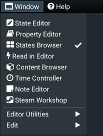

* [**&#xf044; State Editor**](#xf14b-state-editor)
  
* [**&#xf02d; Property Editor**](#xf02d-property-editor)
  
* [**&#xf009; States Browser**](#xf009-states-browser)
  
* [**&#xf0e7; Read in Editor**](#xf0e7-read-in-editor)
  
* [**&#xf1b2; Content Browser**](#xf1b2-content-browser)
  
* [**&#xf017; Time Controller**](#xf017-time-controller)
  
* [**&#xf249; Note Editor**](#xf249-note-editor)
  
* [**&#xf1b7; Steam Workshop**](#xf1b7-steam-workshop)

* Editor Utilities: 
	* [**&#xf1c9; Log**](#xf1c9-log)
	* [**&#xf0ae; Profiler**](#xf0ae-profiler)
	* [**&#xf1da; Command History**](#xf1da-command-history)
  
* Edit:
	* [**&#xf0ad; Settings**](#xf0ad-settings)

### Notification area

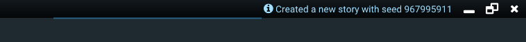

Located in the right area of the main menu, left to the window controls. Short messages are displayed in the notification area for a few seconds. This message is also available in the [**&#xf1c9; Log**](#xf1c9-log) window.

## Text Input
All text components inside the NST Editor can be edited using the right-click context menu. NST Editor doesn't ship with an integrated text editor, but allows you to choose a preferred external text editor. There are currently 4 available editors: Notepad (ships with Windows), [Notepad++](https://notepad-plus-plus.org/), [Sublime Text 4](https://www.sublimetext.com/) and [Microsoft Word](https://www.office.com/).

The text editor will be launched within the NST Editor and will behave as any other NST Editor window does. It can be moved, docked, undocked and closed. Saving the file inside the preferred text editor will automatically propagate the changes made to the text inside the NST Editor. The standard items found in the right-click context menu include:

| | |
|-|-|
|**&#xf044; Edit With > [Preferred Editor]** | Edits the text contents. After a text editor is selected, it will pop up in a new window. You may drag and dock this window as you do with other windows. Once satisfied, you need to save it in your preferred editor and thus automatically propagate the recent changes within the NST Editor. At this point you may close the text editor window.|
|**&#xf0c5; Copy** | Copy the text contents to clipboard.|
|**&#xf0c4; Cut** | Cut the text contents to clipboard.|
|**&#xf0ea; Paste** | Paste from clipboard to text contents. This action will overwrite the existing content.|
|**&#xf057; Clear** | Clear the text contents.|

## &#xf013; State Button
Each [**&#xf013; state**](#xf013-states) in the NST Editor is represented by a single button labeled with the state's **&#xf02b; name**. 

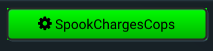

States appear in the form of buttons throughout the NST Editor. Clicking the button will select the state and open it for edit inside the [**&#xf044; State Editor**](#xf14b-state-editor). You can select multiple states by holding the Ctrl button on your keyboard while simultaneously clicking buttons. You can differentiate selected states by the highlighted borders.

An active state's button is red, whereas a green button implies availability. Once you activate the state, the button becomes dark red. The entry state has the &#xf061; icon in front of the name.

Right-clicking a state's button will open up a context menu containing additional actions.

Selecting a state will automatically update the state that was previously selected. 

| | |
|-|-|
|**&#xf044; Edit** | Will select the state and open the [**&#xf044; State Editor**](#xf14b-state-editor).|
|**&#xf079; Reset** | Will reset all passive internal properties of a state. It will clear the *activated* flag as if this state never happened.|
|**&#xf04b; Try Activate** | The state will be activated only if it is available.|
|**&#xf144; Force Activate** | The state will be forcefully activated.|
|**&#xf0a8; Set Entry State** | The state will become the entry state to the story. The entry state becomes the active state when the story is started / restarted.|
|**&#xf24d; Duplicate** | Creates a deep copy of the state under a new name.|
|**&#xf0c5; Copy > [Internal Property]** | Copies the specified state property to clipboard.|
|**&#xf1f8; Delete** | Deletes the state. The entry state cannot be deleted - specify a new entry state before deleting it.|
|**&#xf055; Create Choice** | Creates a new state, selects it and [links the contexted state](#xf0cb-availability-expression) to it with `IS_HAPPENING [ContextedStateName]`.|
|**&#xf060; Depends** | If applicable, lists all states on which this state depends (i.e. what needs to happen for this state to become available). |
|**&#xf061; Dependent** | If applicable, lists all states that depend on it (i.e. the contexted state needs to happen for these states to become available).|
|**&#xf02d; Changing Properties** | If applicable, lists all properties that [are changed](#xf069-change-expression) by this state.|
|**&#xf249; Notes** | Lists all notes attached to the state. Clicking on **&#xf055; Attach a Note** will create a new [note](#xf249-note-display) and attach it to this state.|

If multiple states are selected the context menu offers limited options which include: **&#xf079; Reset**, **&#xf24d; Duplicate** and **&#xf1f8; Delete**.

## &#xf02d; Property Button
Each [**&#xf02d; property**](#xf02d-properties) in the NST Editor is represented by a single button labeled with the property's name. 

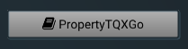

Properties appear as buttons throughout the NST Editor, often besides states. You can distinguish them by the &#xf02d; icon that appears in front of the name. Clicking the button will highlight all states that depend on this property's value, regardless of the window they appear in.

Right-clicking a property's button will open up a context menu containing additional actions.

 
| | |
|-|-|
|**Name** | The name of the property. It must be unique and cannot contain special characters or blank spaces. Updating the same property under a different name will effectively trigger a rename. A property rename will warn the user if the name already exists or if the name contains an illegal word or character.|
|**Value** | The current value of the property.| 
|**Initial Value** | The initial value of the property. The property value will be set to this value once the story is started or restarted.|
|**Value Min** | If the current value is less than this value it will be set to this value.|
|**Value Max** | If the current value exceeds this value it will be set to this value.|
|**Randomize on Reset** | Each time the story restarts, the current value will get a random value in a specified range. The value will depend on the story or branch seed.|
|**Randomize Min** | The lower bound for the random number.|
|**Randomize Max** | The upper bound for the random number.|
|**&#xf093; Update** | Updates the property with the new values.|
|**&#xf1f8; Delete** | Deletes the property.|
|**Dependent States** | Lists all dependent [states](#xf013-states). These states will be highlighted by clicking on the property button. |
|**&#xf249; Notes** | Lists all [notes](#xf249-note-display) attached to the property. Clicking on **&#xf055; Attach a Note** will create a new note and attach it to this property.|

## &#xf06c; Branch Expander
Each [**&#xf06c; branch**](#xf06c-branches) is represented by an expander throughout the NST Editor. A branch can be active (loaded) inside the story to which it belongs. The branch that is active can be [time-manipulated](#xf017-time-controller). Each branch may be saved and loaded (activated).

The expander displays the name of the branch. It will show **&#xf0e7; Active** in front of the name of the branch that is currently active. The expander can be expanded and collapsed. When expanded, it contains the sequence of [states](#xf013-states) representing the branch. There may be duplicate states in the sequence if the state has been activated multiple times.

Right-clicking on the expander title will open a context menu. 

| | |
|-|-|
|**&#xf253; Load** | Will load the branch (activate it). Loading the branch will activate a [states](#xf013-states) which was saved as active along with the branch. It will also set all internal properties of all states as they were when the branch was saved. After the branch is loaded, you may control the time on it by rewinding or advancing the state activation inside the [**&#xf017; Time Controller**](#xf017-time-controller) window. |
|**&#xf246; Rename** | Renames the branch.|
|**&#xf1f8; Delete** | Deletes the branch.|

## &#xf249; Note Display

Notes may be displayed in various places inside the NST Editor. They consist of a frame and a **&#xf249; Note** caption. Notes come with a [standard text input component](#text-input) and can be edited by right-clicking on the content. 

Notes may be attached to [states](#xf013-states), [properties](#xf02d-properties) or the [system as a whole](#xf085-systems).

Some additional features available in text context menu, depending on the attached context, are as follows:

| | |
|-|-|
|**&#xf08d; Pin** | Pins the note to the top. Only attached notes can be pinned.|
|**&#xf12a; Important** | Colors the note red. Only attached notes can be marked as important.|
|**&#xf0c1; Detach** | Detaches the note from the item. This does not delete the note, it will still be available through the [**&#xf249; Note Editor**](#xf249-note-editor). Only attached notes can be detached.|
|**&#xf1f8; Delete** | Detaches the note from all items and deletes it.|

## &#xf14b; State Editor

The &#xf14b; State Editor window is where you edit the internal properties of the states.

>[!NOTE] The simple editor only offers the following options: Name, Situation, Create Choice, Dialog Statements, Attach a Note. They are sufficient for creating branching storylines. To activate the advanced editor view check the **Advanced State Editor** option in the [**&#xf0ad; Settings**](#xf0ad-settings) window under the **Writing** category. In the following section all options, both simple and advanced, will be listed.

>[!NOTE] Multiple states cannot be edited inside the state editor. If multiple states are selected, the Editor will display a message to indicate so.

### Action Buttons

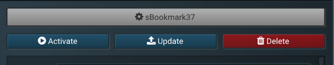

The topmost element is the [state button](#xf013-state-button) for the currently selected [state](#xf013-states).

| | |
|-|-|
|**&#xf144; Activate** | The state will be forcefully activated.|
|**&#xf093; Update** | All changes to the state inside the editor will be propagated inside the system. This is triggered when you either select another state or before saving the story on disk.|
|**&#xf1f8; Delete** | Deletes the state.|

### &#xf02b; State Name
All states are uniquely identified by their name. A state's name must be unique and cannot contain any special characters, reserved words or empty spaces. These rules exist due to the fact that names are used inside expressions to identify the states. Right-clicking on the name editing text box will bring up additional text options.

### &#xf000; Situation
The **&#xf000; situation** tells us what is happening at a given point in time. It will be displayed in the reading area when the state is active. The situation is a [standard text input component](#text-input) that can be edited with an external text editor. Right-clicking it will bring up more options.

>[!TIP]
The situation content may contain any HTML5 / JS / CSS code you may choose to enter. This code will be rendered inside the NST Reader, but not inside the Read in Editor window.

>[!TIP]
Writing a [property](#xf02d-properties) name between [ and ] will render the value of the property instead of the property name. Example: `Strength: [Start_Strength]` will yeild `Strength: 10.0`

### &#xf055; Create Choice button

Clicking this button will create a new state which will automatically be linked to this state. The link is created by automatically adding `IS_HAPPENING [ThisStateName]` in the new state's [**&#xf0cb; Availability Expression**](#xf0cb-availability-expression). The newly created state will then be automatically selected.

### &#xf069; Change Expression

>[!NOTE] This component is still under development and may or may not change in future releases.

The **&#xf069; change expression** defines how a [**&#xf02d; property**](#xf02d-properties) changes when the [**&#xf013; state**](#xf013-states) is activated. The result of a change expression is a floating-point precision number which changes a property value in a specific manner. You may use other properties within the change expression.

To create a change expression, you must first select a property to be changed. This is done via the dropdown menu at the top of the change expression panel. Once the desired property is selected, clicking the &#xf055; button will create the new change expression.

Setting the expression value to a number will change the expression by that value. For instance, if a property has a value of 4, and a state exists whose change expression of that property has a value of 2, the final property value will become 6 (4+2=6) when the state is activated. This value can also be negative.

#### Change Operators

| | |
|-|-|
|**DELTA exp** | Will add *exp* to the property value, similarly to writing *x* in the expression.|
|**DELTANEG exp** | Will subtract *exp* from the property value. |
|**SET exp** | Will set the property value to *exp*.|

#### Type Operators

| | |
|-|-|
|**VALUE** | Will change the current value of the property. This is the default type operator. The expression will be evaluated with it, unless explicitly stated.|
|**INITIAL** | Will change the initial value of the property.|
|**MIN** | Will change the minimum value of the property.|
|**MAX** | Will change the maximum value of the property.|

#### Get Operators

| | |
|-|-|
|**GETVALUE propertyName** | Get the current value of a property. This is the default get operator. Scripting this will get you the same results as simply typing propertyName.|
|**GETMIN propertyName** | Get the minimum value of a property.|
|**GETMAX propertyName** | Get the maximum value of a property.|
|**GETINIT propertyName** | Get the initial value of a property.|

#### Special Operators

| | |
|-|-|
|**DICE rangeMin rangeMax** | Generate a random number in the given range. This random number is seeded by the system and will return the same value for the same system seed. This ensures that the system is deterministic.|
|**DICEX rangeMin rangeMax customSeed** | Generate a random number with a custom seed. This seed is added to the system seed, thus keeping the system deterministic. It returns different numbers for different values of customSeed, as well as the same numbers for the same customSeed.|

#### Examples

	Score_FightingPower => SET VALUE DICEX Score_Dexterity Score_Strength 1

Sets the value of Score_FightingPower to a random custom-seeded number in the range between Score_Dexterity and Score_Strength with a seed number of 1

	PropertyName => SET MIN GETMAX SomeOtherProperty
	
Sets the minimum value of PropertyName to the maximum value of SomeOtherProperty
	
	OtherProperty => DICE GETMIN RandomProperty1 GETMIN RandomProperty2

Adds a value to OtherProperty. The value is a random, non-seeded number between the minimum value of RandomProperty1 and the minimum value of RandomProperty2

#### Using the context menu

Right-clicking the expression will bring up a context menu containing a searchable list of all properties and the operators you may use. Selecting an item from the context menu will append that value to the end of the expression.

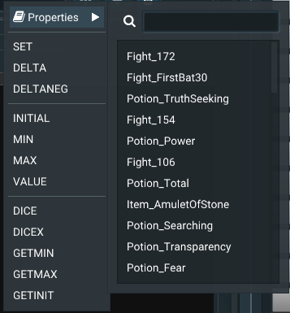

### &#xf0cb; Availability Expression

>[!NOTE] This component is still under development and may or may not change in future releases.

The **&#xf0cb; Availability Expression** defines how a state becomes available. The result of the evaluation of an availability expression is a boolean value (true or false), i.e. true if the state is available, false if the state is not available. The author may use both states and properties in the availability expression.

#### Operators

| | |
|-|-|
|**( )** | It is recommended that you put each sub-expression in parenthesis. `(expression)`|
|**OR** | Binary comparator. Returns true if either of the 2 sub-expressions is true. `(x) OR (x)`|
|**AND** | Binary comparator. Returns true if both of the 2 sub-expressions are true. `(x) AND (x)`|
|**NOT** | Unary operator. Returns the opposite of the 1 sub-expression it is applied to. `NOT (x)`|
|**HAS_HAPPENED** | Unary operator. Returns true if a state has happened in the past. `(HAS_HAPPENED stateName)` |
|**CAN_HAPPEN** | Unary operator. Returns true if a state can happen at the moment. `(CAN_HAPPEN stateName)`|
|**COULD_EVER_HAVE_HAPPENED** | Unary operator. Returns true if a state was ever available in the past. `(COULD_EVER_HAVE_HAPPENED stateName)`|
|**IS_HAPPENING** | Unary operator. Returns true if a state is happening at the moment. `(IS_HAPPENING stateName)`|
|**IS_MORE_THAN** | Binary operator. Returns true if the current property value is more than a numeric value or more than the current value of another property. `(PropertyName IS_MORE_THAN AnotherProperty)`|
|**IS_LESS_THAN** | Binary operator. Returns true if current property value is less than a numeric value or less than the current value of another property. `(PropertyName IS_LESS_THAN 21)`|
|**IS_EQUAL_TO** | Binary operator. Returns true if current property value is equal to a numeric value or equal to the current value of another property. `(PropertyName IS_EQUAL_TO AnotherProperty)`|
|**DICE x y [z]** | Unary operator. Returns a random, seeded number between x and y. An optional custom seed (z) can be supplied. The random number always depends on the global story seed and will return the same number for the same story seed, making the system deterministic. You can use property values in all parameters. `(DICE 2 3 PropertyName)`|

#### Context Menu
The context menu contains all of the items that can be used in the **&#xf0cb; Availability Expression**. Clicking any item will display it after the cursor. If an item inside the availability expression is selected, it will be replaced by the selection in the context menu. Selecting a sub-expression and clicking the **()** item will enclose the item inside parenthesis.

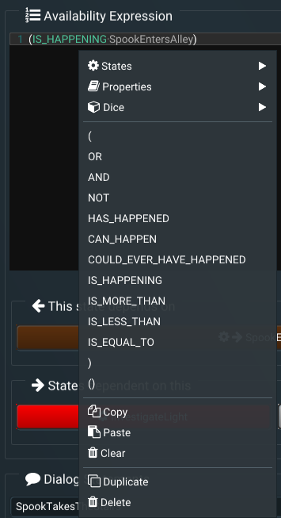

#### Examples

	(IS_HAPPENING sBookmark165 ) 
	AND
	(
		(DICE 1 13 3 IS_MORE_THAN Score_Courage )
		OR
		(DICE 1 13 3 IS_EQUAL_TO Score_Courage )
	)
	
--

	(
		(IS_HAPPENING sPositiveFight)
		OR
		IS_HAPPENING sNegativeFight )
		OR
		(IS_HAPPENING sNegativeFightElusiveness )
		OR
		(IS_HAPPENING sNegativeFightInvincibility )
		OR
		(IS_HAPPENING sPositiveFightSilverLance )
		OR
		(IS_HAPPENING sPositiveFightDouble )
		OR
		(IS_HAPPENING sNegativeFightDouble )
		OR
		(IS_HAPPENING sPositiveFightPower )
		OR
		(IS_HAPPENING sEqualFight )
		OR
		(IS_HAPPENING sFightFirstBat30)
		OR
		(IS_HAPPENING sFightSecondBat30)
		OR
		(IS_HAPPENING sFightThirdBat30)
	)
	AND
	(
		(Creature_Strength IS_MORE_THAN 0) 
	)

### &#xf061; This state depends on

Lists all states and properties that the selected state depends on. The dependency may or may not be exclusive.

### &#xf060; States dependent on this

Lists all states that depend on the selected state. The dependency may or may not be exclusive.

### &#xf075; Dialog statements

Dialog statements are in essence the labels on the buttons that are clicked by the reader whenever they make a decision. To create a dialog statement, you need to choose a state to which dialog statement refers to. There can be different ways to reach a state in a story. Dialog statements can define labels for all states by using the "__ALL" token, or may use a specific state to define the dialog statement for that state.

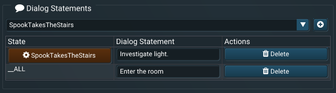

To create a dialog statement, you need to select a state (or "__ALL") from the dropdown menu and click on the &#xf055; button.

### Options

| | |
|-|-|
|**&#xf0e2; Can Happen Again** | If checked, this state can happen an indefinite number of times. Otherwise, once activated, it will never be available again.|
|**&#xf055; Is Exclusively Available** | If checked, whenever this state is available, it will be the only available state, regardless of the availability of other states.|
|**&#xf0ac; Is Global** | If checked, the state can be available whenever. Check this when you want to have a choice that can be always available (i.e. depends only on properties, not states).|
|**&#xf005; Exclude Global States** | If checked, global states will not be available when this state is the active state. Use this if you have states that ignore the global states' availability. For instance, if your character can eat a meal in any moment in time, this will be checked on states in which the character is dead and cannot eat a meal.|

### &#xf1fc; State Head

Whenever this is the active state inside the NST Reader, the code entered here will be inserted in between the `<head></head>` tags. The state head is a [standard text input component](#text-input) and can be edited as such.

### &#xf249; Notes

Displays all [notes](#xf249-note-display) attached to this state.

## &#xf009; States Browser
The **&#xf009; States Browser** window allows different views on all [states](#xf013-states) present inside a story and allows you to quickly create a new state. New states are created by clicking the **&#xf055;&#xf013;** button, in the left-most part of the window. You may choose between 4 main views.

### &#xf00a; Pool View
Pool View shows all states in the form of [state buttons](#xf013-state-button) buttons. You can filter the states by name using the search bar. 

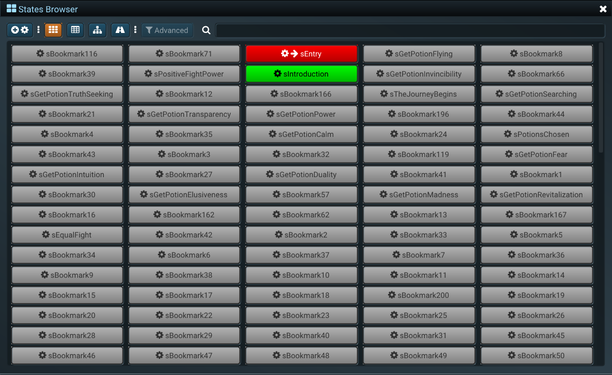

### &#xf0ce; Table View
Table View shows all internal values of each state in multiple pages. You can search by internal value using the search bar. Each token separated by space in the search field is highlighted in a different color. States are sorted by relevance (i.e. number of tokens found inside the state's internal values based on the search query).

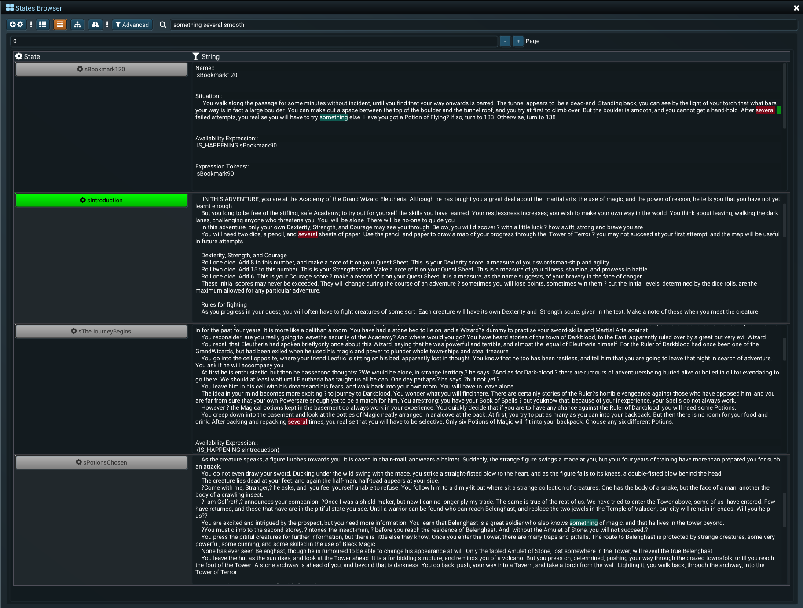

Advanced filtering is enabled in this view. Advanced filtering enables you to filter by internal properties such as: Active, Ever Activated, Selected, Available, Name, [Situation](#xf000-situation), [Availability Expression](#xf0cb-availability-expression), Expression Tokens, [States that depend on this](#xf060-states-dependent-on-this), [Change Expressions](#xf069-change-expression) and/or [Dialog Statements](#xf075-dialog-statements).

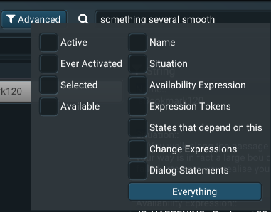

### &#xf0e8; Graph View
Graph View displays a graph of all [states](#xf013-states) and the connections between them. The graph is automatically generated based on the connections between the states. You cannot make connections directly on the graph because the connections may be complex. All [dependable tokens](#xf060-states-dependent-on-this) are taken into consideration when generating connections. This means that the connection may not reflect the relationship between the states, and may include both inclusive and exclusive connections.

This can use it to create a mental map of where in the story a state may appear. 

### &#xf018; Paths View

The purpose of the Paths View is to display [a number of different ways](#xf060-states-dependent-on-this) in which a reader may get from one state to another. The Paths View displays a sequence of states called "a path". Generated paths are sorted by the number of states, thus, the first path is always the shortest path between two states (the quickest way for the reader to get into a state).

>[!WARNING]
For performance and memory reasons, each path in the Paths View is generated by only using state dependencies and not property dependencies. If a state depends on a property, it will be ignored when generating a path. This may be fixed in the future.

| | |
|-|-|
|**Source** | The source state for the path.|
|**Destination** | The destination state for the path. |
|**Max Paths** | Maximum number of paths to generate. This needs to be set, since some states may have infinite number of paths between them.|
|**Search Available** | Only searches states that are available at the moment. Useful when the source is the currently active state.|
|**Search Everything** | Searches all states to generate paths.|
|**Discovered Junctions** | Number of path junctions discovered.|
|**Generated Paths** | Number of paths generated by the action.|

## &#xf02d; Property Editor
The Property Editor lists all [properties](#xf02d-properties) as [property buttons](#xf02d-property-button). Properties are searchable by name using the search bar inside the Editor. You may quickly create a property using the **&#xf055;&#xf02d;** button in the left-most area of the Property Editor.

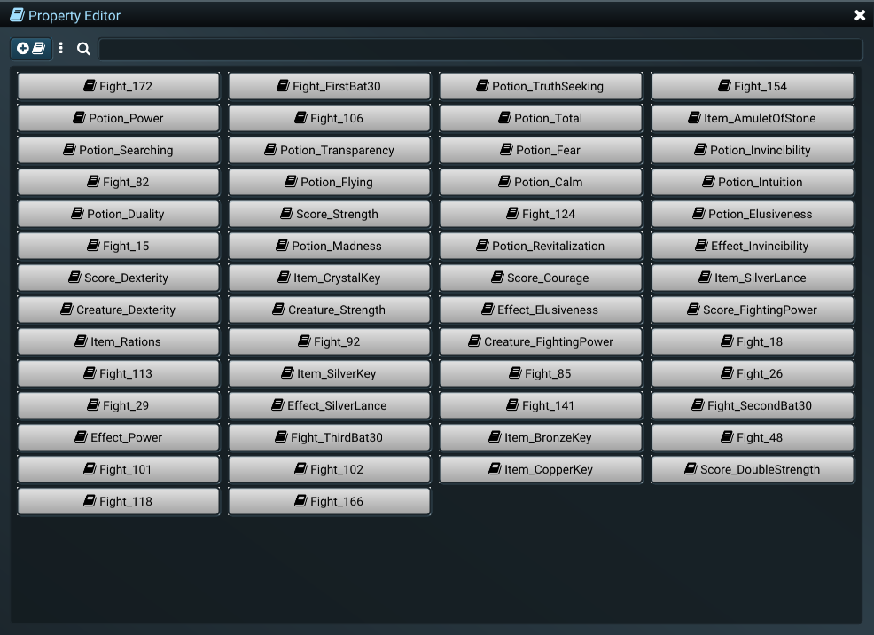

## &#xf0e7; Read in Editor
The story may be read inside the Read in Editor. This window reflects the current state of the story. It displays the [**&#xf000; Situation**](#xf000-situation) of the active story and displays buttons for each available state as a choice. The labels on the buttons reflect the dialog statements of the [available states](#xf0cb-availability-expression) relating to the [active state](#xf013-states). If no [dialog statement](#xf075-dialog-statements) is specified for the currently active state, the Reader will show the "Continue" button.

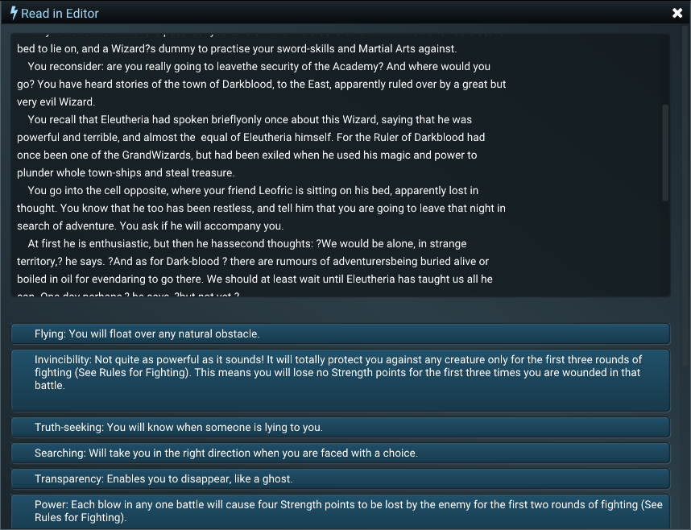

## &#xf1b2; Content Browser

The **&#xf1b2; Content Browser** is used to manage content inside stories. 

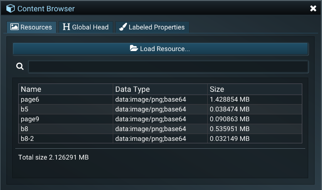

### &#xf03e; Resources

You can embed all kinds of media inside a story, including images, audio, video, basically anything that can be rendered inside a HTML5 document. You can choose any resource from the internet to embed. This would imply that the reader must have an active internet connection. To illustrate, to load a resource from the internet would be to reference it in the html as such: ``

NST also offers you to include offline content inside the story via the Resources panel. If you choose to load an offline resource than this resource would be embedded inside the **.nss** file. When a resource is loaded it is immediately converted to [base64](https://www.w3docs.com/snippets/html/how-to-display-base64-images-in-html.html) encoding. Then, it is dynamically embedded whenever a state is activated inside the Reader.

Below is a list of all supported file formats that can be loaded via the Resource panel:

* apng
* avif
* gif
* jpg
* jpeg
* jfif
* pjpeg
* pjp
* png
* svg
* webp
* wav
* wave
* webm
* ogg
* css
* csv
* webm
* js
* json
* mp3
* mpeg
* oga
* ogv
* otf
* ttf
* txt
* xml
* mp4

To embed an offline resource inside a state, you need to reference it by its name using the `{resource=ResourceName}` syntax.

**Examples:**

``

`<video controls src="{resource=20200510_171050}">`

To rename a resource, you enter a new name inside the appropriate textbox in the **Actions** column. After you enter the desired name, click the **&#xf0c7; Save** button. 

To delete a resource, click the **&#xf1f8; Delete** button. 

Hitting the **&#xf0c5; Copy** button will copy the correct HTML snippet for the selected resource. The examples above are generated in such manner. 

Clicking the **&#xf07c; Load** button will allow you to load the same resource from another file.

### &#xf1dc; Global Head

This is a code snippet that will be embedded between the `<head>...here...</head>` tags on all states inside the story. You can add JS code or CSS styles for you story here. The global head is a [standard text input component](#text-input) and can be edited as such.

### &#xf1fc; Labeled Properties

Labeled properties are [&#xf02d; properties](#xf02d-properties) that you might want to have visible inside the Reader all the time. They usually appear on the left of the story, but can be styled however using the [Global Head](#xf1dc-global-head) or [State Head](#xf1fc-state-head) styles. The list inside the Reader has the property label and the current value shown.

To add a new label, select a property from the properties dropdown, write a label and click on the left-most &#xf055; button.

To change the label of a labeled property, enter a new name in the textbox below the **Label** column. Once you have entered the desired name, click the **&#xf0c7; Save** button to save your changes. The **&#xf0c7; Save** button will be disabled if the label has not been changed.

The order of the list within the Editor is also the order of the list within the Reader. Each labeled property can be reordered by clicking the **&#xf062; or &#xf063;** buttons right beside the label textbox. 

To delete a labeled property, click the **&#xf1f8; Delete** button.

## &#xf017; Time Controller

The time controller window enables you to rewind or advance the history of events in the story. It has three tabs - the **&#xf017; Time Controls** tab, the **&#xf0e7;Active Branch** tab and the **&#xf06c; Branches Browser** tab.

### &#xf017; Time Controls

| | |
|-|-|
|**&#xf049; Rewind** | Will rewind the history of events by a single event.|
|**&#xf050; Advance** | Will advance the history of events by a single event.|
|**&#xf253; Time** | A slider that numbers all events that have happened inside the story. You can enter any number to go at that particular event in the story.|
|**&#xf079; Reset** | Clicking this button will reset the *whole story*, meaning that the story will begin from the start with a new seed.|

### &#xf0e7; Active Branch
| | |
|-|-|
|**&#xf079; Reset Branch** | Clicking this button will only reset the *current branch*, meaning that the story will begin from the start with *the same seed*. All random events will happen in the same way.|
|**&#xf0c7; Save Branch** | Will save the active branch. All saved branches appear in the **&#xf06c; Branches Browser**. You can load a branch at any point as long as the story has not changed in a way in which the branch can no longer execute (i.e. you have deleted a state that happened in a branch). |
|**&#xf074; Seed** | This is the current seed of the active branch. You can change it by writing a new number inside the textbox and then clicking the **&#xf0c7; Save** button. A seed can be reset after editing by clicking the **&#xf00d; Cancel** button.|

### &#xf06c; Branches Browser

The branches browser lists all saved branches in the [Branch Expander](#xf06c-branch-expander) format.

## &#xf249; Note Editor

The note editor displays all notes available within the system in the [Note Display](#xf249-note-display) format. You can create a new note by clicking the **&#xf055; Create a Note** button. The newly-created note will not be attached to any system component yet.

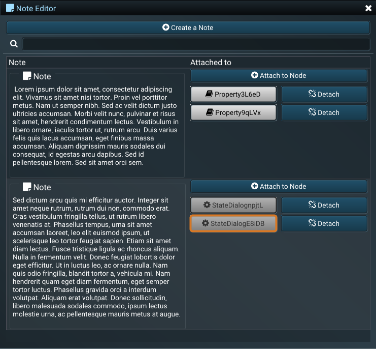

To attach a note, click on the **&#xf055; Attach to Node** button in the **Attached to** column. This will open a list of available [states](#xf013-states), [properties](#xf02d-properties) or the [system as a whole](#xf085-systems) to which you may attach this note. 
 
 To detach a note, click on the **&#xf127; Detach** button for the appropriate node.

## &#xf1b7; Steam Workshop

The **&#xf1b7; Steam Workshop** window allows an integrated connection to the Steam Workshop. It also requires an active internet connection as well as an active connection to Steam. 

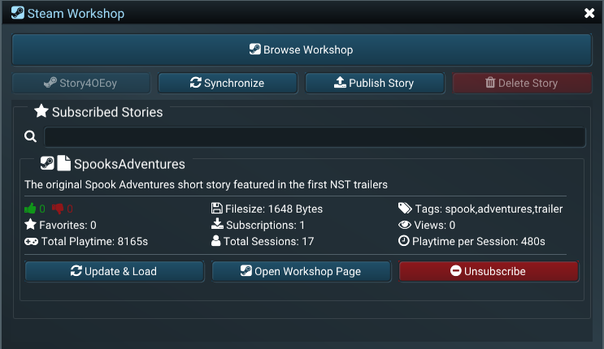

| | |
|-|-|
|**&#xf1b7; Browse Workshop** | Will open the NST Steam Workshop in a Steam overlay.|
|**[Story Name]** | If available, will open the Steam Workshop page for the current story in the Steam overlay.|
|**&#xf1f8; Delete** | If applicable, will delete the story from the Steam Workshop.|
|**&#xf019; Download**|This window lists Steam Workshop stories you are subscribed to by default. To download a story, click on the **&#xf019; Download** button. This will download the story to the Steam Workshop default folder and also copy it to the root folder of the Editor, so that you can easily access it via the **&#xf15b; File > &#xf07c; Load** menu. |
|**&#xf021; Update & Load**|If a story is already available, this button will be named **&#xf021; Update & Load** and clicking it will automatically load the story inside the Editor.|

Right-clicking any workshop item will open a context menu.

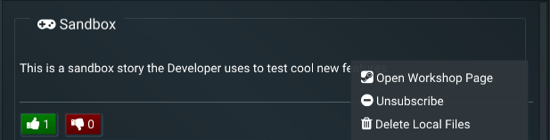

| | |
|-|-|
|**&#xf1b7; Open Workshop Page** | Will open the Steam Workshop page of the selected story in a Steam overlay window.|
|**&#xf056; Unsubscribe** | Will remove the story from the list of stories you are subscribed to.|
|**&#xf1f8; Delete Local Files** | Will remove all previously downloaded local files for the item.|

### &#xf093; Publishing a Story
To publish a story on the Steam Workshop you need to have the story you want to publish [opened in the Editor](#file). Click on the **&#xf093; Publish Story** button in the Steam Workshop window. This will open a new view which will allow you to publish your story on the Steam Workshop.

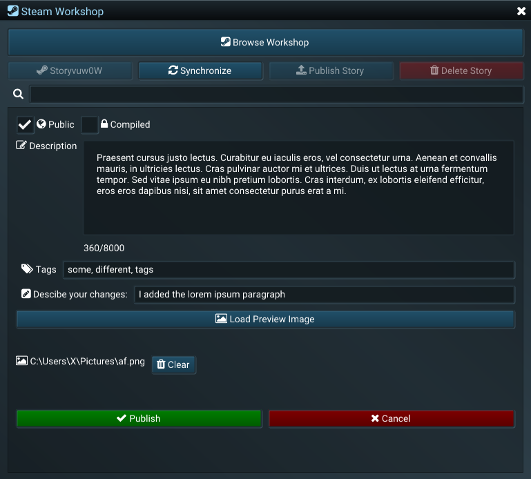

| | |
|-|-|
|**&#xf0ac; Public** checkbox | If checked, the story will be public after publishing, otherwise it will be unlisted.|
|**&#xf023; Compiled** checkbox | If checked, the story will be compiled and encrypted, meaning that it will be read-only and can be fully opened only in the NST Reader.|

>[!WARNING]
Compiled stories cannot be decompiled and decrypted.

| | |
|-|-|
|**&#xf044; Description** | The description that will appear on the Steam Workshop page.|
|**&#xf02c; Tags** | Tags for the given story. Each tag should be separated by a comma.|
|**&#xf044; Describe your changes** | This comment will appear in the list of changes on your private view of the Steam Workshop page.|
|**&#xf03e; Load Preview Image** | The preview image of the story. Steam recommends a square resolution (for example, 1000px by 1000px). After you load a picture, you can clear it by clicking the **Clear** button to the right of the file path.|
|**&#xf00c; Publish** | Will publish the story on the Steam Workshop with the given settings.|
|**&#xf00d; Cancel** | Will cancel the publishing and show the subscriptions view of the stories.|

## &#xf0ad; Settings
Lists all of the available editor options.

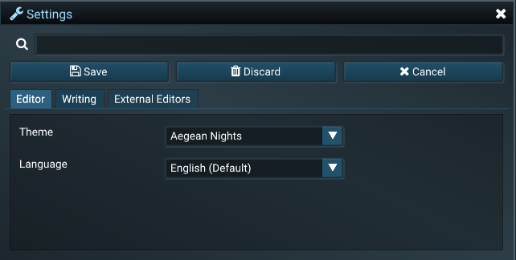

| Editor | |
|-|-|
| **Language** | English (Default), Macedonian, Russian or Ukrainian |
| **Theme** | Aegean Nights (desaturated blue), Pacific Dawn (dark purple), Talk Yawl (stronger blue) |

| Writing | |
|-|-|
| **Backups** | No backups, Rare (backup in every 30 actions), Frequent (backup in every 5 actions), Always (backup after each action). |
| **Advanced State Editor** | Adds additional (advanced) options to the State Editor. Check this if you want to use the scripting language instead of using simple choices for your story. |

| External Editors | |
|-|-|
| **Special Option** | You can set any external editors you want to use here. The **name** is what will appear in the context menu, **Exe location** is the absolute path where the executable of the editor is located and **Arguments** are the arguments with which the editor will be launched. The pre-defined editors are: Notepad, Notepad++, Word, Sublime. To add a new one hit the **+** button. |

## &#xf1c9; Log

All messages generated by the Editor will pop up inside the **&#xf1c9; Log** window. These messages can be useful to both you and the developers. There are 6 relevant columns for each message.

| | |
|-|-|
|**#** | The number of occurrences.|
|**Level** | The type of message and how it affects the system. **STATEMENT** and **NOTICE** messages provide general information about an event, whereas **WARNING** and **ERROR** are usually messages of concern that should be addressed.|
|**Time** | The time of which the message occurred.|
|**Subsystem** | The internal subsystem in which the message occurred.|
|**Line** | The line in the subsystem at which the message was fired.|
|**Message** | The message text.|

## &#xf0ae; Profiler

>[!NOTE] The &#xf0ae; Profiler is an internal developer tool and you will probably need it rarely (if ever). It is used to test the performance of the Editor when writing complex stories.

## &#xf1da; Command History

The history of all commands executed in the Editor is listed inside the **&#xf1da; Command History** window. This is the undo / redo stack. You can move anywhere in the history of commands by selecting any command. The current command is highlighted and has a **bolt** icon. All previous commands are colored with a lighter color, while all commands that are after the current command are colored with a darker color. The point at which you saved the story has a **save** icon before the identifier and is also highlighted in orange. Discarding changes will set the history cursor to this point.

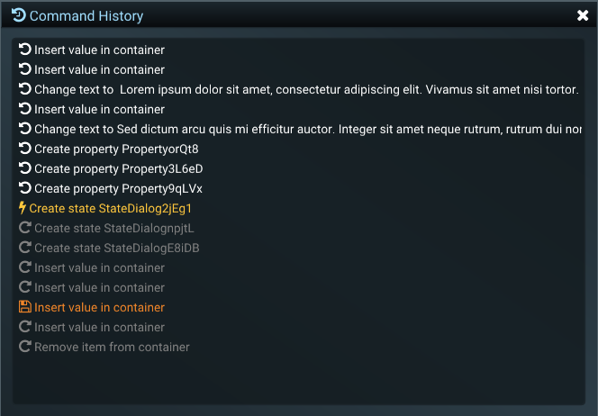

## Keyboard Shortcuts

>[!NOTE] Keyboard shortcuts are Editor-wide, they do not conform to the context of the selected window.

| Key Combination | Action |
|---------------|----------| 
| **Ctrl + S**  | Save the currently open story as a .nss file|
| **Ctrl + N**  | Create a new story|
| **Ctrl + R**  | Reset the branch and keep the story seed|
| **F5** | Reset the story with a new seed|
| **Alt + Arrow Left** | Rewind the story|
| **Alt + Arrow Right** | Advance the story|
| **Ctrl + Shift + Del** | Delete the story|
| **F2** | Create a new state|
| **F3** | Create a new property|
| **Ctrl + Z** | Undo|
| **Ctrl + Y** | Redo|
| **F1** | Help|
| **Ctrl + E** | Export the story to .xml|
| **Ctrl + O** | Stream a story in from a .nss file|
| **Ctrl + Shift + O** | Open target folder for saving .nss files|
| **Ctrl + I** | Import a story from an .xml file|
| **Ctrl + Shift + R** | Reload an already loaded story|
| **Ctrl + C** | Copy|
| **Ctrl + X** | Cut|
| **Ctrl + V** | Paste|
| **Ctrl + Arrow Left** | Go back to the previously visited state|
| **Ctrl + Arrow Right** | Go forward to the next visited state|
| **F9** | Update state|
| **Ctrl + A** | Try activating the currently selected state|
| **Ctrl + F** | Force activate the currently selected state|
| **Ctrl + 1** | Set the currently selected state to be the entry state|

# NST Reader

The NST Reader displays the final form of stories written in the NST Editor by rendering the underlying HTML, loading all static resources and converting all tokens to values. All stories saved in a NSS format can be loaded inside the NST Reader, both compiled and uncompiled.

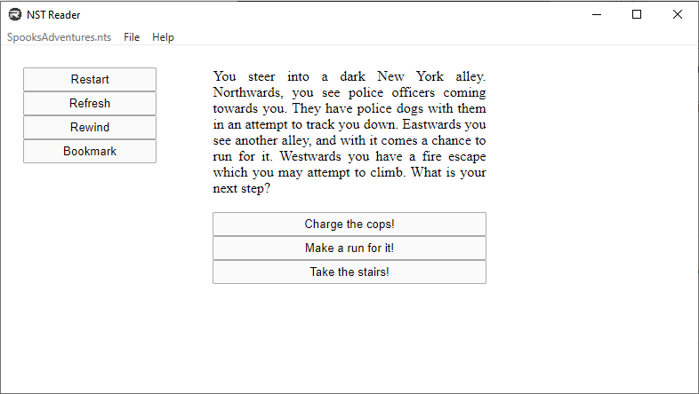

To load a story select **File > Load...** inside the Reader. Once you select a story, click **OK** and the story will be loaded and rendered inside the Reader. To reload a story click on **File > Reload**.

To progress a story, you may be required to click on buttons to make a choice, depending on the type. There may or may not be additional buttons present, depending on what the author of the story may have chosen to use.

You can also load stories from the **&#xf1b7; Steam Workshop** inside the Reader. To open a story from the **&#xf1b7; Steam Workshop**, go to **File > &#xf1b7; Steam Workshop**, select a story that you want to read and hit on the Read button located just under the name and the author of the story.

## Styling the Reader components

You can use CSS or JS to modify the default components of the Reader. Available classes and ids:

| Selector | Description |
|-----------|------------|
| **button**   | Selects all buttons |
| **#nst-Situation** | Selects the situation text |
| **#nst-labeledPropertiesTable** | Selects the labeled properties table |
| **#nst-labeledPropertiesTable td** | Selects each element in the labeled properties table |
| **#nst-MainMenuWrapper** | Selects the main menu |
| **#nst-MainMenuWrapper button** | Selects the buttons in the main menu |

# Files
## NSS
Main file format used accross the tools. Encrypted text file. Both the Editor and the Reader can open NSS files. NSS files are backwards compatible. Can be compiled (read-only) or not compiled. Compiled NSS files can only be opened as read-only in the Editor or inside the Reader. There is no (official) way to decompile a NSS file.

## NTS (LEGACY)

>[!WARNING] 
The NTS file format is set for deprecation. Please load & save all your stories in the new NSS format. NTS will be supported in legacy versions of the editor.

Encrypted binary file. Both the Editor and the Reader can open NTS files, but the editor only saves in NSS format. NTS files are not backwards compatible. Can be compiled (read-only) or not compiled. Compiled NTS files can only be opened as read-only in the Editor or inside the Reader. There is no (official) way to decompile a NTS file.

## NTX
ASCII file that can be read in the Editor. This is a text format that contains a special syntax which is easier for non-technical people to write in, but it has limited capabilities. NTX files can be imported in the Editor using the [import pipeline](#file). A story cannot be exported to NTX because of the limited possibilities of NTX.

### Syntax

To define a [&#xf013; state](#xf013-states), you need to write inside the NTX file:

	===
	[StateName]
	This is where you describe the situation inside this state.

To define the state's connections you should write:

	===
	[StateName]
	This is where you describe the situation inside this state.
	---
	[SomeOtherState]: Click here to go to SomeOtherState
	
To define a complex state [**&#xf0cb; Availability Expression**](#xf0cb-availability-expression) should write:

>[!WARNING] Writing a custom [**&#xf0cb; Availability Expression**](#xf0cb-availability-expression) will override the current connections you might have to this state.

	===
	[StateName]
	This is where you describe the situation inside this state.
	---
	[#] (HAS_HAPPENED State1) AND (HAS_HAPPENED State3)
	
[**&#xf02d; Properties**](#xf02d-properties) are declared at the top of the file. The first parameter is the current value of the property, the second is the minimum value and the third is the maximum value. Example:

	[Property1]: 0 -1 1
	[Property2]: 15 4 5
	===
	[StateName]
	This is where you describe the situation inside this state.
	---
	[#] (HAS_HAPPENED State1) AND (HAS_HAPPENED State3)
	
Properties can be used inside a state using the **[&#xf069; change expressions](#xf069-change-expression)**:

	[Property1]: 0 -1 1
	[Property2]: 15 4 5
	===
	[StateName]
	This is where you describe the situation inside this state.
	---
	[#] (HAS_HAPPENED State1) AND (HAS_HAPPENED State3)
	[Property1]: DELTANEG 3
	[Property2]: SET 3

## XML
Every story can be exported to XML. Stories in XML format are not encrypted and cannot be compiled to XML. The XML format is backwards compatible, meaning that XML stories created using different versions of the Editor can be opened in any Editor version. Stories in XML format can only [be read inside the Editor](#file). If you are using a version control system, it is highly recommended that you keep the stories in XML format. 

# API

API Versions

| Version | Architecture |Links |
|-----------|-|------------|
| 0.3.220410 | x64 | [NSTAPI-03220410.zip](https://www.najjak.com/nst/docs/NSTAPI-03220410.zip) |
| 0.3.220409 | x64 | [NSTAPI-03220409.zip](https://www.najjak.com/nst/docs/NSTAPI-03220409.zip) |
| 0.2.220108 | | No API available :( |
| 0.2.220101 | | No API available :( |
| 0.2.211211 | | No API available :( |
| 0.2.211203 | | No API available :( |

### size_t NST_CreateNewWorld();
Creates a new NST World. Remember to always call NST_DeleteWorld to avoid a memory leak.

**returns** Either a 32-bit or a 64-bit handle (memory location) of the newly created World.

### void NST_DeleteWorld(size_t handle);
Deletes the provided NST World.

**handle** The handle of the NST World to delete. This handle must be prevously created by NST_CreateNewWorld.

### size_t NST_GetNumAvailableStates(size_t handle);
Gets the number of currently available states.

**handle** The handle of the NST World.

**returns** The number of available states.

### const char* NST_GetStateNameAtIndex(size_t handle, size_t index);
Gets the name of the state at the given index. Usually used in combination with NST_GetNumAvailableStates.

**handle** The handle of the NST World.

**index** The index at which to get the state name.

**returns** The name of the state at the given index, no whitespaces.

### bool NST_IsStateAvailable(size_t handle, const char* stateName);
Gets the availablilty of a state with a given state name.

**handle** The handle of the NST World.

**stateName** The name of the state which is the context of this check.

**returns** True if the state is available, false if the state is not available or there is an error.

### const char* NST_GetDialogStatementAtIndex(size_t handle, size_t index);
Gets the dialog statement (named choice) at the given index.

**handle** The handle of the NST World.

**index** The index of the state for which to return the actual dialog statement.

**returns** The dialog statement string.

### const char* NST_GetActiveStateSituation(size_t handle);
Gets the situation string in the currently active state.

**handle** The handle of the NST World.

**returns** The situation string of the active state.

### void NST_ActivateStateByIndex(size_t handle, size_t index);
Activate the state with the given index. If the state is not available the state will not be activated.

**handle** The handle of the NST World.

**index** The index of the state.

### void NST_ActivateStateByName(size_t handle, const char* stateName);
Activate the state with the given name. If the state is not available the state will not be activated.

**handle** The handle of the NST World.

**stateName** The name of the state.

### void NST_ResetStory(size_t handle);
Resets the story with a new seed.

**handle** The handle of the NST World.

### void NST_LoadFromString(size_t handle, const char* str);
Attempts to load a story from the provided string.

**handle** The handle of the NST World.

**str** The string loaded from a .nss file or generated via some other method.

# Changelog

Please follow the change announcements on [Steam](https://store.steampowered.com/news/app/1772160)
