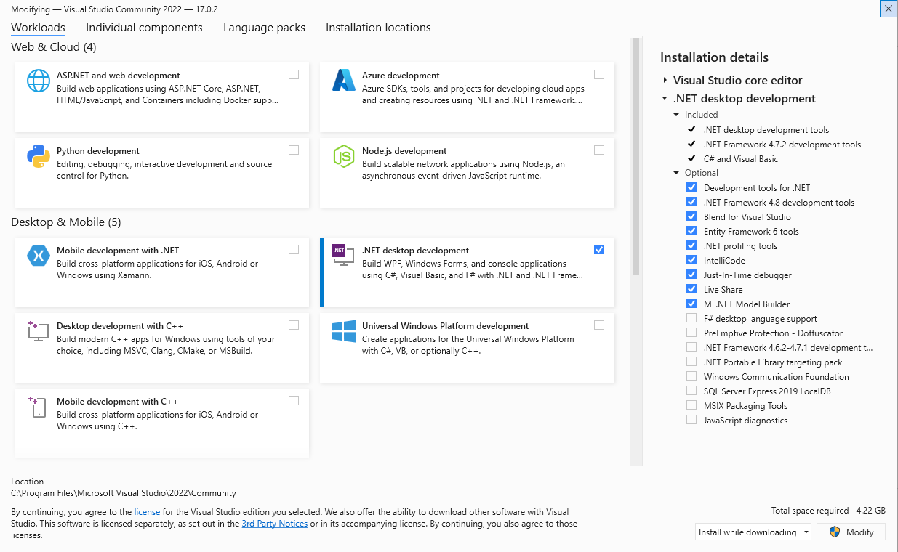

# Информации

**Демонстратор:** [Мартин Петковски](https://www.najjak.com/spao/martin-petkovski-cv.pdf)  (petkovski.martin@uklo.edu.mk)

**&#xf017; Термин:** Секој вторник од 17:00 до 18:30 

**&#xf1a0; Линк:**  https://meet.google.com/txh-ojfe-opi

**&#xf392; Дискорд:** https://discord.gg/mrNnKgbSCQ

### Потребен софтвер

[&#xf019; MySQL Server](https://dev.mysql.com/downloads/file/?id=508935) (GPL)

[&#xf019; MySQL Workbench](https://dev.mysql.com/downloads/workbench/) (GPL)

[&#xf019; Visual Studio 2022](https://visualstudio.microsoft.com/thank-you-downloading-visual-studio/?sku=Community&rel=17) (Бесплатен за студенти)

---

# 09.11.2021 - Запознавање и вовед
 [&#xf1c4; PowerPoint презентација](https://www.najjak.com/spao/resources/spao-vezhbi-01.pptx).

---

# 16.11.2021 - Star Schema

### Задачи

#### 01
Во една онлајн продавница можете да нарачате продукти од различен тип. 

Таа онлајн продавница чува податоци со различни компоненти за своите: 
- продажби (**Sales**)
- муштерии (**Customers**)
- продукти (**Products**) 
- вработени (**Employees**). 

Овие компоненти дополнително содржат податоци за: **SaleID, SalePerson, SaleAmount, CustomerDimID, CustomerID, Phone, Address, CustomerName, City, State, Country, ProductDimID, ProductID, ProductName, Category, Description, EmployeeDimID, EmployeeID, FirstName, LastName, Status, Manager, DateDimID, DateID, Date, Month, Quarter, Year, IsHoliday.**

Конструирајте star schema од дадените податоци.

[&#xf019; Workbench решение](https://www.najjak.com/spao/resources/Vezhbi02_Zadacha01.mwb)

[&#xf03e; Слика од шемата](https://www.najjak.com/spao/resources/Vezhbi02_Zadacha01.png)

#### 02
Во онлајн продавницата на Steam можете да купите и играте видео игри. 

Steam чува податоци со различни компоненти за: 
- достигнувања на играчите (**Achievements**)
- играчи (**Players**)
- игри (**Games**)
- партнери (**Partners**)

Овие компоненти дополнително содржат податоци и за: **AchievementID, AchievementName, AchievementTime, AchievementImageUrl, PlayerDimID, PlayerID, Nickname, PlayerDescription, PlayerImageUrl, PlayerCreationDate, GameDimID, GameID, GameName, GameDescription, GameImageUrl, PartnerDimID, PartnerID, PartnerName, PartnerCreationDate, DateDimID, DateID, Date, Month, Year, IsSale.**

Конструирајте star schema од дадените податоци.

[&#xf019; Workbench решение](https://www.najjak.com/spao/resources/Vezhbi02_Zadacha02.mwb)

[&#xf03e; Слика од шемата](https://www.najjak.com/spao/resources/Vezhbi02_Zadacha02.png)

---

# 23.11.2021 - Колоквиумска Недела 🥳

---

# 30.11.2021 - Snowflake Schema

### Задачи

#### 03

Во една компанија за продажба на хартија можете да нарачате одредена количина на листови хартија.

Компанијата чува податоци за:
- Приход (**Revenue**)
- Продукт (**Product**)
- Филијала (**Branch**)
- Муштерија (**Customer**)
- Датум (**Date**)

Овие компоненти дополнително содржат податоци за: **RevenueID, UnitsSold, RevenueAmount, CustomerID, CustomerName, CustomerPhoneNumber, LocationID, Region, CountryID, CountryName, BranchID, BranchName, BranchAddress, ProductID, ProductName, VariantID, VariantName, VariantTreeType, DateID, Year, Month, Quarter, Date**

Конструирајте snowflake schema од дадените податоци.

[&#xf019; Workbench решение](https://www.najjak.com/spao/resources/Vezhbi03_Zadacha03.mwb)

[&#xf03e; Слика од шемата](https://www.najjak.com/spao/resources/Vezhbi03_Zadacha03.png)

#### 04

Една авиокомпанија управува со летови помеѓу различни градови во светот.

Компанијата чува податоци за:
- Приход (**Revenue**)
- Летови (**Flights**)
- Пилоти (**Pilots**)
- Датум  (**Date**)

Овие компоненти дополнително содржат податоци за: **RevenueID, FuelSpent, PassengersTransported, RevenueAmount, FlightID, FlightFromID, FlightToID, FlightTime, CityID, Country, CitySize, PilotID, PilotName, PilotNationality PilotTotalHoursFlight, DateID, Year, Month, Quarter, Date**

Конструирајте snowflake schema од дадените податоци.

#### Решенија:

| Студент | Workbench | Слика |
|---------|-----------|-------|
|**Владимир Павловски**|[&#xf019; Симни](https://www.najjak.com/spao/resources/VladimirPavlovski_Zadaca04.mwb)|[&#xf03e; Отвори](https://www.najjak.com/spao/resources/VladimirPavlovski_Vezhbi03_Zadacha04.png)|
|**Антонио Ристевски**| [&#xf019; Симни](https://www.najjak.com/spao/resources/AntonioRistevski_Zadaca04.mwb)|[&#xf03e; Отвори](https://www.najjak.com/spao/resources/AntonioRistevski_Vezhbi03_Zadacha04.png)

#### 05

Во онлајн продавницата на Steam можете да купите и играте видео игри. 

Steam чува податоци со различни компоненти за: 
- достигнувања на играчите (**Achievements**)
- играчи (**Players**)
- игри (**Games**)
- партнери (**Partner**)
- издавачи (**Publisher**)

Овие компоненти дополнително содржат податоци и за: **AchievementID, AchievementName, AchievementTime, AchievementImageUrl, PlayerID, Nickname, PlayerDescription, PlayerImageUrl, PlayerCreationDate, CountryID, CountryName, CountryTimeZone, GameID, GameName, GameDescription, GameImageUrl, DeveloperID, DeveloperName, DeveloperLocation, PublisherID, PublisherName, PublisherCountry, PublisherCreationDate, DateID, Date, Month, Year, IsSale.**

Конструирајте snowflake schema од дадените податоци.

#### Решенија:

| Студент | Workbench | Слика |
|---------|-----------|-------|
|**Антонио Ристевски**| [&#xf019; Симни](https://www.najjak.com/spao/resources/AntonioRistevski_Zadaca05.mwb)|[&#xf03e; Отвори](https://www.najjak.com/spao/resources/AntonioRistevski_Vezhbi03_Zadacha05.png)

---

**МАЛА ИСПРАВКА: Кликот на пипетата за креирање на релација во MySQL Workbench треба да биде од изворот кон дестинацијата, наместо обратно. Со ова се елиминира потребата од рачно креирање индекси. Ваквите релации од дестинација кон извор би создавале проблеми при имлементирањето на визуелизација. Сите фајлови и слики се исправени.**

---

# 07.12.2021 - Constellation Schema

#### 06

Во светскиот завод за статистика се чуваат податоци корисни за државите кои се членки.

Податоците кои се чуваат се поделени во компонентите:
- држави (**Countries**)
- датум (**Dates**)
- извори (**Sources**)
- демографија (**Demographics**)
- време (**Weather**)

Овие компоненти дополнително содржат податоци за: **CountryID, CountryName, CountryRegion, CountryCapital, DateID, DateYear, DateMonth, DateDay, SourceID, SourceName, SourceEmail, SourceTelNumber, DemographicID, NumPopulation, NumForeigners, NumElectricCars, NumNaturalLakes, WeatherID, WeatherNumValue, WeatherDescription**

Конструирајте constellation schema од дадените податоци.

[&#xf019; Workbench решение](https://www.najjak.com/spao/resources/Vezhbi04_Zadacha06.mwb)

[&#xf03e; Слика од шемата](https://www.najjak.com/spao/resources/Vezhbi04_Zadacha06.png)

#### 07

Во онлајн продавницата на GOG можете да купите и играте видео игри. 

GOG чува податоци со различни компоненти за: 
- достигнувања на играчите (**Achievements**)
- приход по играч (**RevenuePlayer**)
- приход по издавачи (**RevenuePublisher**)
- играчи (**Players**)
- игри (**Games**)
- издавачи (**Publishers**)

Овие компоненти дополнително содржат податоци и за: **AchievementID, AchievementName, AchievementTime, AchievementImageUrl, PlayerRevenueID, PlayerRevenueAmount, PlayerGameID, PublisherRevenueID, PublisherRevenueAmount, PublisherCutAmount, PublisherGameID, PlayerID, Nickname, PlayerDescription, PlayerImageUrl, PlayerCreationDate, CountryID, CountryName, CountryTimeZone, GameID, GameName, GameDescription, GameImageUrl, PublisherID, PublisherName, PublisherCountry, PublisherCreationDate, DateID, Date, Month, Year, IsSale.**

Конструирајте constellation schema од дадените податоци.

#### Решенија:

| Студент | Workbench | Слика |
|---------|-----------|-------|
|**Владимир Павловски**|[&#xf019; Симни](https://www.najjak.com/spao/resources/VladimirPavlovski_Zadacha07.mwb)|[&#xf03e; Отвори](https://www.najjak.com/spao/resources/VladimirPavlovski_Vezhbi04_Zadacha07.png)|
|**Антонио Ристевски**| [&#xf019; Симни](https://www.najjak.com/spao/resources/AntonioRistevski_Zadaca07.mwb)|[&#xf03e; Отвори](https://www.najjak.com/spao/resources/AntonioRistevski_Vezhbi04_Zadacha07.png)

---

# 14.12.2021 - Генерирање на податоци во C#

### Потребни алатки:

- Visual Studio 2022 Community со .NET desktop development пакет
- MySQL Connector (NUGET)

### Генерирање на податоци
	using MySqlConnector;
	using System;
	using System.Collections.Generic;
	using System.Security.Cryptography;
	using System.Windows;

	namespace Example1
	{
		public class Utils
		{
			public static Random rnd = new Random();
			public static string InsertFormat(string table, List<object> values)
			{
				string retVal = "";

				retVal += "insert into " + table + " values(";
				foreach (object item in values)
				{
					if (item is string)
					{
						retVal += "\"" + item + "\", ";
					}
					else
					{
						retVal += item + ", ";
					}
				}
				retVal = retVal.Substring(0, retVal.Length - 2);
				retVal += ");";

				return retVal;
			}

			public static string GenerateRandomString(int min, int max)
			{

				int stringlen = Utils.rnd.Next(min, max);
				string str = "";
				for (int i = 0; i < stringlen; i++)
				{
					int randValue = Utils.rnd.Next(0, 26);

					char letter = Convert.ToChar(randValue + 65);

					str += letter;
				}

				return str;
			}

			public static int RandIntFromList(List<int> list)
			{
				int index = Utils.rnd.Next(0, list.Count - 1);
				return list[index];
			}
		}

		public class FactSales
		{
			public static string GenerateCommand(int iterations)
			{
				string retVal = "";
				for (int i = 0; i < iterations; i++)
				{
					int customerDimID = Utils.RandIntFromList(DimCustomers.ids);
					int productDimID = Utils.RandIntFromList(DimProducts.ids);
					int salesPersonID = Utils.RandIntFromList(DimEmployees.ids);
					int OrderDateDimID = Utils.RandIntFromList(DimDate.ids);
					int DeliveryDateDimID = Utils.RandIntFromList(DimDate.ids);
					int saleID = Utils.rnd.Next(10000000);

					float salesAmount = Utils.rnd.Next(10000);

					int quantity = Utils.rnd.Next(1000);
					retVal += Utils.InsertFormat("factsales", new List<object>()
				{ saleID,
					customerDimID,
					productDimID,
					salesPersonID,
					OrderDateDimID,
					DeliveryDateDimID,
					salesAmount,
					quantity }
			   );
				}

				return retVal;
			}
		}

		public class DimProducts
		{
			public static List<int> ids = new List<int>();
			public static string GenerateCommand(int iterations)
			{
				string retVal = "";
				for (int i = 0; i < iterations; i++)
				{
					
					int productDimID = Utils.rnd.Next(10000000);
					ids.Add(productDimID);
					int productID = Utils.rnd.Next(10000000);

					string ProductName = Utils.GenerateRandomString(10, 40);
					int category = Utils.rnd.Next(1000);
					string description = Utils.GenerateRandomString(30, 200);

					retVal += Utils.InsertFormat("dimproducts", new List<object>()
					{
						productDimID,
						productID,
						ProductName,
						category,
						description
					});
				}
				return retVal;
			}
		}

		public class DimDate
		{
			public static List<int> ids = new List<int>();
			public static string GenerateCommand(int iterations)
			{
				string retVal = "";
				for (int i = 0; i < iterations; i++)
				{
					int dateID = Utils.rnd.Next(10000000);
					ids.Add(dateID);

					DateTime myDateTime = DateTime.Now;
					string sqlFormattedDate = myDateTime.ToString("yyyy-MM-dd HH:mm:ss.fff");

					string month = myDateTime.Month.ToString();
					int quarter = Utils.rnd.Next(4);
					string year = myDateTime.Year.ToString();
					int isHoliday = 0;

					retVal += Utils.InsertFormat("dimdate", new List<object>()
					{
						dateID,
						sqlFormattedDate,
						month,
						quarter,
						year,
						isHoliday
					}
					);
				}

				return retVal;
			}
		}

		public class DimCustomers
		{
			public static List<int> ids = new List<int>();

			public static string GenerateCommand(int iterations)
			{
				string retVal = "";
				for (int i = 0; i < iterations; i++)
				{
					int customerDimID = Utils.rnd.Next(10000000);
					ids.Add(customerDimID);
					int customerID = Utils.rnd.Next(10000000);

					string customerName = Utils.GenerateRandomString(5, 20);
					string address = Utils.GenerateRandomString(5, 20);
					string phone = Utils.rnd.Next(100000000).ToString();
					string city = Utils.GenerateRandomString(5, 20);
					string state = Utils.GenerateRandomString(5, 20);
					string country = Utils.GenerateRandomString(5, 20);

					retVal += Utils.InsertFormat("dimcustomers", new List<object>()
					{
						customerDimID,
						customerID,
						customerName,
						address,
						phone,
						city,
						state,
						country
					}
					);
				}
				return retVal;
			}
		}

		public class DimEmployees
		{
			public static List<int> ids = new List<int>();
			public static string GenerateCommand(int iterations)
			{
				string retVal = "";
				for (int i = 0; i < iterations; i++)
				{
					int employeeDimID = Utils.rnd.Next(10000000);
					ids.Add(employeeDimID);
					int employeeID = Utils.rnd.Next(10000000);

					string firstName = Utils.GenerateRandomString(5, 20);
					string lastName = Utils.GenerateRandomString(5, 20);
					int status = Utils.rnd.Next(1);
					string managerName = Utils.GenerateRandomString(5, 20);
					retVal += Utils.InsertFormat("dimemployees", new List<object>()
					{
						employeeDimID,
						employeeID,
						firstName,
						lastName,
						status,
						managerName
					}
					);
				}

				return retVal;
			}
		}

		public partial class MainWindow : Window
		{
			private MySqlConnection connection;
			public MainWindow()
			{
				InitializeComponent();
			}

			~MainWindow()
			{
				connection.Close();
			}

			public void Initialize()
			{
				connection = new MySqlConnection("server=localhost;user=root;password=pasvord123;database=sales");
				try
				{
					connection.Open();
				}
				catch (Exception ex)
				{
					MessageBox.Show("Error connecting to MySQL: " + ex.Message, "MySQL Connection", MessageBoxButton.OK, MessageBoxImage.Error);
				}
			}

			private void ExecuteCommand(string commandText)
			{
				MySqlCommand command = connection.CreateCommand();
				command.CommandText = commandText;

				try
				{
					command.ExecuteNonQuery();
				}
				catch (Exception ex)
				{
					MessageBox.Show("Error executing MySQL command: " + ex.Message, "MySQL Connection", MessageBoxButton.OK, MessageBoxImage.Error);
				}
			}

			private void ClearData()
			{
				ExecuteCommand("delete from factsales; delete from dimemployees; delete from dimcustomers; delete from dimdate; delete from dimproducts;");
			}

			private void Window_Loaded(object sender, RoutedEventArgs e)
			{
				Initialize();

				if (connection == null || connection.State != System.Data.ConnectionState.Open)
					return;

				ClearData();

				string dimProductsCommand = DimProducts.GenerateCommand(20);
				string dimDateCommand = DimDate.GenerateCommand(500);
				string dimCustomersCommand = DimCustomers.GenerateCommand(500);
				string dimEmployeesCommand = DimEmployees.GenerateCommand(100);
				string factSalesCommand = FactSales.GenerateCommand(1000);

				ExecuteCommand(dimProductsCommand + dimDateCommand + dimCustomersCommand + dimEmployeesCommand + factSalesCommand);
			}
		}
	}

